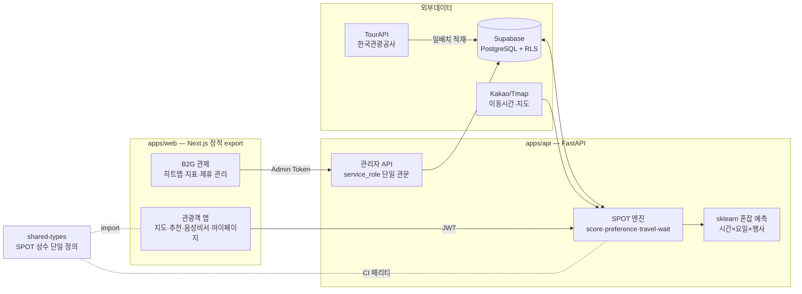

# NextSpot

[](https://github.com/NextSpot-knu/NextSpot/actions/workflows/ci.yml)

> **2026 관광데이터 활용 공모전 · ① 웹·앱 개발 부문 출품작.**
> 경주 황리단길의 **오버투어리즘을 실시간으로 분산·재배치**하는 AI 기반 대안 장소 추천 웹 서비스.

포화한 인기 관광지 대신, 사용자의 취향·**도착시점 예측 대기시간**·도보 거리·제휴 인센티브를 종합한
**SPOT(Smart Place Optimization for Tourism)** 점수로 한산한 대안 장소를 추천하여
관광객의 기회비용을 줄이고 골목 상권으로 수요를 재배치합니다.

---

## 🏆 핵심 차별점 (왜 지도 앱·웨이팅 앱이 아닌가)

| # | 차별점 | 설명 |
|---|---|---|
| 1 | **도착시점 예측 혼잡** | 구글/네이버 지도는 '지금' 혼잡을 보여준다. NextSpot은 이동시간을 계산해 **"당신이 도착할 시점"의 혼잡**을 sklearn 회귀모델(시간대×요일×행사)로 예측해 추천에 반영한다. |
| 2 | **개인 효용 + 공익 기여를 한 산식에** | w₃ 인센티브 = 소상공인 **제휴 쿠폰 강도**(할인율 연속값) + **수요 재배치 기여**(원본혼잡 − 도착시점 예측혼잡)의 결합. 관광객의 이득과 도시의 혼잡 완화가 같은 방향을 보게 설계. |
| 3 | **음성 AI 비서** | 지도를 볼 수 없는 이동 중 상황에서 "다음", "양식 먹고 싶어" 같은 자유발화로 추천 탐색 (Gemini 의도분류 + 키워드 폴백). |
| 4 | **피드백 학습 취향 벡터** | 수락(+10%)/거절(−5%)이 8차원 선호 벡터를 실시간 보정 — 쓸수록 나에게 맞는 추천. |
| 5 | **B2G 관제 대시보드** | 경북문화관광공사 관점의 혼잡 히트맵·수요 분산 지표·제휴(쿠폰) 관리 — 소비자 앱과 데이터가 순환하는 양면 구조. |

## 핵심 알고리즘 — SPOT_Score

```
SPOT_Score = w₁ · 취향 일치율 − w₂ · (도착시점 예측 대기 + 이동시간) + w₃ · 인센티브
             w₁ = 0.40        w₂ = 0.40                              w₃ = 0.20

인센티브 = 0.5 · min(1, 쿠폰할인율/20%) + 0.5 · max(0, 원본혼잡 − 후보 도착시점 예측혼잡)
```

- 구현: [`apps/api/app/services/spot/score.py`](./apps/api/app/services/spot/score.py) (런타임 정본)
- 상수 공유: [`packages/shared-types/spot.ts`](./packages/shared-types/spot.ts) — 프론트 시뮬레이터와 단일 정의점,
  **CI 패리티 테스트가 양쪽 정합을 강제** (한쪽만 바꾸면 빌드 실패)
- 점수 분해(`preference/wait/travel/incentive_coupon/incentive_relief`)를 응답에 포함 → **추천 사유가 투명**

## 📊 데이터 활용 — 한국관광공사 TourAPI 매핑 (공모전 필수 요건)

| TourAPI 엔드포인트 | 역할 | SPOT 반영 지점 |
|---|---|---|
| `locationBasedList2` | 황리단길 반경 POI 실조회·적재 | 추천 후보군 (관광지 12 · 문화시설 14 · 음식점 39, 카페는 cat3 분리) |
| `areaBasedList2` | 지역 단위 POI 목록 | 후보군 보강·일배치 캐시 |
| `detailCommon2` / `detailIntro2` | 운영시간·소개·이미지 | 후보 속성·카드 표시 |
| `detailInfo2` (무장애) | 배리어프리 정보 | 선호 벡터 **접근성 차원 가중** (`barrier_free`) |
| `searchFestival2` | 당일 경주 축제·행사 | 예측 대기시간의 외부 변수 (행사 시 혼잡 상향) |

- 클라이언트: [`apps/api/app/services/tourapi/`](./apps/api/app/services/tourapi/) (비동기 + 일 1회 캐시)
- 적재 배치: `python apps/api/scripts/ingest_tourapi.py` (contentid 기준 upsert, `--dry-run` 지원)
- 보조 데이터: 경주시 교통데이터(공공데이터포털, 혼잡 베이스라인) · Kakao/Tmap(이동시간) · Supabase Realtime(실시간 갱신)

## 아키텍처



```
NextSpot/
├── apps/web/            # Next.js 16 — 관광객 앱 + B2G 관제 대시보드
├── apps/api/            # FastAPI — SPOT 추천 · 혼잡 예측 · TourAPI 파이프라인
│   ├── app/services/spot/      # SPOT 산식 (런타임 정본)
│   ├── app/services/tourapi/   # 한국관광공사 OpenAPI 클라이언트
│   └── scripts/ingest_tourapi.py
├── packages/shared-types/      # SPOT 상수·타입 단일 정의점 (web ↔ api)
├── supabase/migrations/        # 스키마 정본 (RESET 은 scripts/build_reset.mjs 자동 생성)
└── .github/workflows/ci.yml    # web·api·schema 3중 검증
```

## 주요 기능

1. **혼잡도 예측 지도** — 황리단길 거점 실시간 혼잡 + 시간대별 **AI 예측 모드** (도착 시점 혼잡 미리보기)
2. **대안 장소 추천** — 혼잡 임계 초과 시 SPOT 랭킹 + Gemini 생성 추천 사유 카드 + 카카오맵 길안내 연결
3. **음성 AI 비서** — 자유발화 탐색·수락·필터 ("첨성대 근처 한적한 카페")
4. **AI 취향 프로필** — 온보딩 Cold Start(카테고리 3개+) → 피드백 학습 → 마이페이지 취향 레이더
5. **B2G 관제 대시보드** — 혼잡 히트맵·추천 수락률·DAU·피크 시뮬레이션·POI/제휴 관리
6. **개입 폐루프 & 효과 정량화** — 쿠폰 정책 패널(POI별 할인율 조정 → 추천 순위 즉시 반영) +
   "오늘 절감 대기시간 N분 · 재배치 M건" 분산 효과 위젯 (관제→개입→효과 측정의 완결)

## 품질 · 보안

- **CI 3중 검증**: web(lint→typecheck→test→build) · api(ruff→pytest) · schema(마이그레이션↔RESET 일치)
- **테스트**: SPOT 산식 정확값 회귀(가중치 변경 시 실패) · shared-types 패리티 · TourAPI 파서 · 음성 의도분류
- **보안**: RLS 강화(권한상승 차단·PII 보호), 관리자 쓰기 service_role 단일 관문, 시크릿 env 전용, 상수시간 토큰 비교
- **정직한 데이터 표시**: 실측 없는 시설은 '데이터 없음', 예측값은 'AI 예측' 라벨 — 합성값을 실측처럼 보이지 않게 함
- **예측 백테스트**: `train.py --evaluate` 시간순 홀드아웃 MAE(기준선 대비) → 대시보드 정확도 배지 — [`docs/MODEL_CARD.md`](./docs/MODEL_CARD.md)

## 실행법

```powershell
.\run_local.ps1            # 백엔드(8000) + 프론트(3000) 동시 기동
```

```bash
# 백엔드
cd apps/api && pip install -r requirements.txt -r requirements-dev.txt
uvicorn app.main:app --reload --port 8000    # API 문서: http://localhost:8000/docs
# 프론트
cd apps/web && npm install && npm run dev    # http://localhost:3000
# 테스트
pytest apps/api -q && npm run test --workspace=apps/web
```

환경변수·DB 셋업·스모크 테스트: [`LOCAL_RUN.md`](./LOCAL_RUN.md) · 배포: [`docs/DEPLOY_AND_ENV.md`](./docs/DEPLOY_AND_ENV.md)

## 기술 스택

| 영역 | 기술 |
| --- | --- |
| 프론트 | Next.js 16 (정적 export), React 19, TypeScript, Tailwind CSS, Recharts |
| 백엔드 | FastAPI (Python 3.11), 로컬 scikit-learn (Ridge 혼잡 예측) |
| 데이터 | Supabase (PostgreSQL + RLS + Realtime), **TourAPI(한국관광공사, 필수)**, 경주 교통데이터 |
| AI | SPOT 추천 엔진(자체) · Gemini(추천 사유·음성 의도) · 선호 벡터 피드백 학습 |
| 지도 | Kakao Maps SDK · Kakao/Tmap 경로 |

## 지역 특화와 확장성

**왜 경주 황리단길인가** — 도보권 고밀도 POI, 상시 오버투어리즘, 스마트관광도시(2022) 인프라,
경주 APEC(2025) 이후 급증한 관광 수요. 경북문화관광공사(RTO) 협력으로 B2G 실증에 최적.

**다지역 확장은 설정 교체로** — 서비스 지역 좌표·경계·프리셋은 `apps/web/lib/region.ts` 와
`.env` 기준좌표에 집약. 전주 한옥마을·부산 감천문화마을 확장 시 코드 수정 없이 지역 팩 교체 +
`ingest_tourapi.py --lat --lng` 재실행이면 된다.

| 단계 | 기간 | 목표 |
| --- | --- | --- |
| MVP | 2026.05 ~ 09 | 경주 황리단길 웹앱 · TourAPI 실적재 · SPOT 엔진 · 예측 지도 |
| 확장 1 | 2026 ~ 2028 | 경북 5개 관광 밀집 구역 · 경북문화관광공사 MOU · 제휴 쿠폰 티어 상용화 |
| 확장 2 | 2029 ~ | 전국 오버투어리즘 핫스팟 30개소 · B2G 지자체 대시보드 라이선스 |

## 기대 효과

- **관광객** — 도착 전 혼잡 확인 + 즉시 실행 가능한 대안 → 대기 시간(기회비용) 절감
- **소상공인** — 제휴 쿠폰 티어(할인율↑ = 추천 노출↑)로 골목 유휴 업소에 수요 유입 → 상권 균형화
- **지자체** — 데이터 기반 혼잡 관제 → 규제 없는 수요 분산, 스마트 관광도시 KPI 연계
- **지역 주민** — 오버투어리즘 완화 → 생활 편의 보호

---

> **프로젝트 계보**: 산업단지 혼잡 분산 플랫폼 InduSpot 의 검증된 SPOT 엔진·아키텍처를 시드로,
> 관광 도메인(TourAPI·경주)으로 전면 재구성했습니다. 적응 명세: [`docs/NEXTSPOT_PIVOT.md`](./docs/NEXTSPOT_PIVOT.md) ·
> 개선 로드맵: [`docs/IMPROVEMENT_PLAN.md`](./docs/IMPROVEMENT_PLAN.md) · 심사 대응: [`docs/CONTEST_STRATEGY.md`](./docs/CONTEST_STRATEGY.md)

**팀 Next Spot** · 서진석(PM/기획) · 오윤성(AI/Backend) · 정동기(Frontend) · 김승용(Data/Infra)
