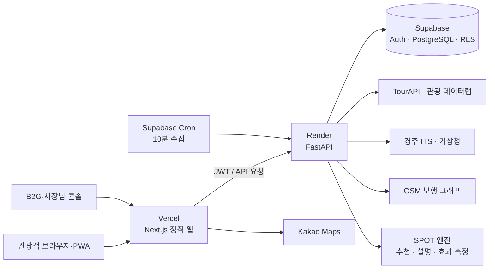

# NextSpot

[](https://github.com/NextSpot-knu/NextSpot/actions/workflows/ci.yml)
[](./apps/web)
[](./apps/api)

> 붐비는 경주에서, 취향과 상황에 맞는 **다음 장소**를 찾습니다.

**NextSpot**은 경주 황리단길의 관광 수요를 주변 골목과 대안 장소로 분산하는 AI 추천 서비스입니다.
한국관광공사 관광 데이터, 경주 ITS 주차 수요, 실제 보행 경로, 사용자 취향과 제휴 혜택을
**SPOT(Smart Place Optimization for Tourism)** 점수로 결합해 “지금 어디로 이동하면 좋은지”를 설명 가능한 형태로 제안합니다.

[🌐 서비스 체험](https://nextspot-nu.vercel.app) ·
[📘 API 문서](https://nextspot-api.onrender.com/docs) ·
[🟢 API 상태](https://nextspot-api.onrender.com/health)

> **2026 관광데이터 활용 공모전 · 웹/앱 개발 부문 출품작**
>
> 마지막 문서 갱신: **2026-08-27**

---

## 지금 구현된 제품

NextSpot은 관광객 앱 하나에 머물지 않고, 관광객의 선택이 지역 운영으로 이어지는 세 개의 화면을 제공합니다.

| 제품 | 주요 사용자 | 구현된 기능 |
| --- | --- | --- |
| **관광객 앱** | 경주 방문객 | 취향 온보딩, 지도·검색, 유명 명소 기반 대안 탐색, SPOT Top 3 비교, 음성 제어, 다중 경유 코스, 저장·쿠폰·여행 임팩트 |
| **B2G 관제** | 지자체·관광기관 | 실시간 수요 지도, 추천 퍼널·분산 효과, 지역별 성과 분석, POI·쿠폰 정책, 안전·문의 관리 |
| **사장님 콘솔** | 지역 상인 | 내 매장 지표, 시간대별 수요 전망, 쿠폰 발급·사용 성과, 타임세일 운영 브리핑 |

관광객 앱은 한국어·영어·일본어·중국어를 지원하며, PWA 설치와 오프라인 복원,
경주 현지 시각 기준 자동 야간 테마를 제공합니다.

## 핵심 기능

- **유명 명소에서 대안으로** — 첨성대·월정교·황리단길 한옥 카페 같은 대표 경험을 기준점으로 삼아,
  같은 테마를 가진 덜 붐비는 장소를 탐색합니다. 유명 장소 자체를 추천 결과로 강제하지 않습니다.
- **현장형 영업정보 업데이트** — Kakao 최신 장소 정보와 방문객 교차 확인을 결합해
  영업 상태가 바뀌는 현장에서도 추천 후보를 빠르게 갱신합니다.
- **완성된 계정 흐름** — 익명으로 바로 시작한 뒤 이메일 계정으로 데이터를 합칠 수 있고,
  비밀번호 복구·프로필 동기화·계정 및 개인정보 삭제를 지원합니다.
- **개인화 Top 3 비교** — 후보별 취향 일치도, 실제 도보시간, 혜택, 주변 수요 차이를 비교해
  왜 순위가 달라졌는지 보여줍니다.
- **도착 시점 지역 수요** — 경주 ITS 주차 스냅샷을 10분 단위로 축적하고,
  현재 수요와 시간대별 이력을 결합해 사용자가 도착할 시점의 지역 상황을 추천에 반영합니다.
- **현장형 모바일 UX** — 경주 현지 시각과 기상청 날씨, 축제 맥락, 음성 명령, PWA,
  18:00~06:00 자동 다크 모드로 이동 중 사용성을 보강했습니다.

## 사용자 여정

1. **바로 시작** — 익명 세션 또는 이메일 계정으로 접속하고 취향 카테고리를 선택합니다.
2. **상황 탐색** — 지도, 장소 검색, 유명 명소 테마 또는 음성으로 원하는 경험을 말합니다.
3. **대안 비교** — 도착 시점 영업 가능성, OSM 보행시간, 취향, 혜택과 주변 수요를 한 화면에서 비교합니다.
4. **이동** — 한 장소를 선택하거나 2~3개 정류지의 분산 코스를 만들고 Kakao 길찾기로 연결합니다.
5. **현장 피드백** — 추천 수락·거절과 영업 여부 제보가 취향 벡터와 운영 근거를 갱신합니다.
6. **성과 확인** — 저장 장소, 쿠폰, 방문 기록과 개인 여행 임팩트를 확인합니다.

## 핵심 경쟁력

| 경쟁력 | 구현 방식 |
| --- | --- |
| **도착 시점 추천** | 현재 위치와 실제 보행시간으로 도착 시각을 계산하고, 그 시점의 지역 수요와 영업 상태를 반영합니다. |
| **개인 효용과 공익 기여를 함께 계산** | 취향·시간 비용·쿠폰 혜택과 지역 수요 분산 기여를 하나의 SPOT 산식에 반영합니다. |
| **직선거리가 아닌 보행 경로** | 번들된 OpenStreetMap 보행 그래프의 최단 경로로 거리와 이동시간을 계산합니다. |
| **설명 가능한 Top 3** | 전체 점수뿐 아니라 취향, 이동, 혜택과 분산 기여를 후보별 차이로 보여줍니다. |
| **관광객·상인·지자체를 잇는 플랫폼** | 관광객의 선택, 상인의 혜택, 관광기관의 정책 개입이 하나의 추천 데이터 흐름으로 연결됩니다. |
| **관제→개입→효과 측정 폐루프** | 관광기관의 쿠폰 정책이 다음 추천에 반영되고, 수락·이동·방문 결과가 분산 효과 지표로 돌아옵니다. |

심사 서사와 비즈니스 모델은 [`docs/CONTEST_NARRATIVE.md`](./docs/CONTEST_NARRATIVE.md)에서 자세히 설명합니다.

## 만드는 가치

- **관광객** — 줄을 서는 대신 취향에 맞는 대안을 즉시 발견해 여행 시간을 더 가치 있게 사용합니다.
- **지역 상인** — 인기 동선 밖의 매장도 취향과 혜택을 기반으로 발견되고, 쿠폰 성과를 직접 확인합니다.
- **관광기관** — 혼잡을 규제로 막는 대신 추천과 인센티브로 분산하고, 실제 이동 성과까지 측정합니다.
- **지역사회** — 관광 만족도를 유지하면서 특정 골목에 집중되는 생활 부담과 상권 편중을 완화합니다.

## SPOT 추천 엔진

```text
raw_score = 0.40 × preference
          - 0.40 × time_cost
          + 0.20 × incentive

incentive = 0.5 × coupon_strength
          + 0.5 × demand_relief

SPOT_Score = min-max normalize(raw_score)  # 0.0 ~ 1.0
```

- `preference`: 온보딩과 수락(+10%)/거절(-5%) 피드백으로 갱신되는 8차원 취향 벡터
- `time_cost`: 도착 시점 대기 근거 + 실제 보행시간 + 제한된 주변 수요 비용을 60분 기준으로 정규화
- `coupon_strength`: 할인율 20%를 상한으로 정규화한 제휴 혜택
- `demand_relief`: 혼잡한 원본 장소에서 더 여유로운 후보로 이동할 때의 분산 기여

SPOT 엔진은 사용자의 취향 벡터를 읽고, 실제 보행 경로로 도착 시각을 계산한 뒤,
지역 수요·관광 통계·축제·날씨·영업정보를 결합해 후보를 평가합니다. 추천 이후의 수락·거절·방문 결과는
다음 추천과 B2G 성과 지표로 이어집니다.

구현 정본은 [`apps/api/app/services/spot/score.py`](./apps/api/app/services/spot/score.py)이며,
프런트 공용 상수는 [`packages/shared-types/spot.ts`](./packages/shared-types/spot.ts)에 있습니다.
CI 패리티 테스트가 가중치 `0.40 / 0.40 / 0.20`의 불일치를 차단합니다.

## 데이터 활용

| 데이터 | 역할 | SPOT 활용 |
| --- | --- | --- |
| **한국관광공사 TourAPI** | 관광지·문화시설·음식점·카페, 상세 정보, 이미지, 무장애 정보, 축제 | 풍부한 대안 장소 후보군 구성 |
| **관광 데이터랩 API** | 관광지 일별 집중률, 실제 이동 기반 연관 관광지 | 미래 수요 맥락과 유사 경험 후보 발굴 |
| **경주시 ITS** | 반경 2km 공영주차 잔여면 | 10분 단위 지역 수요 흐름과 도착 시점 판단 |
| **OpenStreetMap** | 도보 네트워크 | 실제 보행 동선 기반 이동 비용 계산 |
| **Kakao** | 지도, 장소 ID·좌표·주소, 길찾기, 영업정보 | 탐색부터 현장 이동까지 연결 |
| **기상청 단기예보** | 경주 시간대별 날씨 | 실내외 장소 선택과 여행 맥락 개인화 |
| **Supabase** | 인증, 장소, 추천, 피드백, 방문 결과 | 개인화 학습과 관광 수요 분산 성과 연결 |

TourAPI 엔드포인트별 매핑과 데이터 흐름은 [`docs/DATA_UTILIZATION.md`](./docs/DATA_UTILIZATION.md)를 참고하세요.

## 아키텍처


```mermaid
flowchart LR
    U[관광객 브라우저·PWA] --> W[Vercel<br/>Next.js 정적 웹]
    G[B2G·사장님 콘솔] --> W
    W -->|JWT / API 요청| A[Render<br/>FastAPI]

    A --> S[(Supabase<br/>Auth · PostgreSQL · RLS)]
    A --> T[TourAPI · 관광 데이터랩]
    A --> I[경주 ITS · 기상청]
    A --> O[OSM 보행 그래프]
    W --> K[Kakao Maps]

    C[Supabase Cron<br/>10분 수집] --> A
    A --> E[SPOT 엔진<br/>추천 · 설명 · 효과 측정]
```

```text
NextSpot/
├── apps/
│   ├── web/                  # Next.js 관광객 앱 + B2G 관제 + 사장님 콘솔
│   └── api/                  # FastAPI 추천·데이터·인증 API
├── packages/shared-types/    # SPOT 상수와 프런트 공용 타입
├── supabase/migrations/      # DB 스키마 정본
├── scripts/                  # 적재·스키마 생성·운영 검증 도구
├── docs/                     # 데이터·모델·배포·공모전 문서
└── .github/workflows/        # CI, 데이터 적재, 운영 상태 확인
```

> 📍 **폴더 구조·전 기능·연결관계의 상세 정본은 [`docs/SYSTEM_MAP.md`](./docs/SYSTEM_MAP.md)** —
> 화면↔API↔서비스↔테이블 전수 매핑, SPOT 파이프라인, 추천·운영·성과 연결 구조.

## 기술 스택

| 영역 | 기술 |
| --- | --- |
| Web | Next.js 16.3.1, React 19, TypeScript 5, Tailwind CSS 4, Recharts, Framer Motion, Playwright |
| API | FastAPI, Python 3.11, Pydantic, scikit-learn, Ruff, Pytest |
| Data | Supabase Auth/PostgreSQL/RLS/Realtime/Cron, 한국관광공사 API, 경주 ITS, 기상청 API |
| Map | Kakao Maps SDK, Kakao Local, OpenStreetMap 보행 그래프 |
| AI | 자체 SPOT 엔진, Upstage Solar 음성 의도 분류·운영 브리핑, 선호 벡터 학습 |
| Deploy | Vercel, Render, GitHub Actions |

## 로컬에서 실행하기

### 요구사항

- Node.js **20 이상** (`22` 권장, CI 기준)
- Python **3.11**
- Supabase 프로젝트
- 선택: Kakao Maps/Local, TourAPI, 기상청 API 키

### 1. 설치

```powershell
git clone https://github.com/NextSpot-knu/NextSpot.git
cd NextSpot

npm ci
py -3.11 -m venv apps/api/.venv
.\apps\api\.venv\Scripts\python.exe -m pip install -r apps/api/requirements.txt -r apps/api/requirements-dev.txt
```

### 2. 환경변수

```powershell
Copy-Item apps/api/.env.example apps/api/.env
Copy-Item apps/web/.env.example apps/web/.env.local
```

두 파일에서 최소한 다음 값을 설정합니다.

```text
apps/api/.env
  SUPABASE_URL
  SUPABASE_ANON_KEY
  SUPABASE_SERVICE_ROLE_KEY
  JWT_SECRET
  ADMIN_API_TOKEN

apps/web/.env.local
  NEXT_PUBLIC_SUPABASE_URL
  NEXT_PUBLIC_SUPABASE_ANON_KEY
  NEXT_PUBLIC_KAKAO_MAPS_APP_KEY
  NEXT_PUBLIC_FASTAPI_URL=http://localhost:8000
```

새 Supabase 프로젝트는 `supabase/RESET_AND_SETUP.sql`을 한 번 실행합니다.
기존 프로젝트는 `supabase/migrations/`를 순서대로 적용합니다.

> `NEXT_PUBLIC_*` 값은 브라우저 번들에 포함됩니다. 비밀키를 넣지 마세요.

### 3. 실행

```powershell
.\run_local.ps1
```

- Web: <http://localhost:3000>
- API: <http://localhost:8000>
- Swagger UI: <http://localhost:8000/docs>

Windows 외 환경의 개별 실행법, Docker, DB 설정과 스모크 테스트는 [`LOCAL_RUN.md`](./LOCAL_RUN.md)를 참고하세요.

## 품질 게이트

```powershell
# Web
npm run lint --workspace=apps/web
npm run typecheck --workspace=apps/web
npm run test --workspace=apps/web
npm run build --workspace=apps/web

# API (apps/api에서 실행)
cd apps/api
python -m ruff check .
python -m pytest -q

# E2E (저장소 루트에서 실행)
cd ../..
npm run test:e2e --workspace=apps/web

# DB 스키마 정합성
node scripts/build_reset.mjs
git diff --exit-code supabase/RESET_AND_SETUP.sql
```

GitHub Actions는 Web lint·typecheck·unit·build, API Ruff·Pytest, DB 스키마 패리티,
Chromium 모바일·4개 언어 E2E를 검증합니다.

## 품질과 운영 기반

- **자동 검증** — Web lint·typecheck·unit·build, API Ruff·Pytest, DB 스키마 패리티와 모바일 E2E를 CI에서 실행합니다.
- **계정 연속성** — 익명 사용 기록을 회원 계정으로 트랜잭션 병합해 첫 방문부터 재방문까지 개인화를 이어갑니다.
- **데이터 보호** — Supabase RLS와 JWT 인증으로 사용자별 데이터를 분리하고, 서버 쓰기는 FastAPI를 통해 처리합니다.
- **다국어 품질** — 한국어·영어·일본어·중국어 키 패리티와 실제 모바일 여정을 자동 검사합니다.

배포 환경변수와 운영 체크리스트는 [`docs/DEPLOY_AND_ENV.md`](./docs/DEPLOY_AND_ENV.md)를 참고하세요.

## 문서 지도

| 문서 | 내용 |
| --- | --- |
| [`docs/HANDOVER.md`](./docs/HANDOVER.md) | 가장 최신 구현 상태와 운영 인계 |
| [`docs/SYSTEM_MAP.md`](./docs/SYSTEM_MAP.md) | 화면↔API↔서비스↔DB 전체 연결 관계 |
| [`docs/DATA_UTILIZATION.md`](./docs/DATA_UTILIZATION.md) | 공공데이터 엔드포인트와 SPOT 반영 근거 |
| [`docs/MODEL_CARD.md`](./docs/MODEL_CARD.md) | 예측 모델 평가와 운영 승격 체계 |
| [`docs/CONTEST_NARRATIVE.md`](./docs/CONTEST_NARRATIVE.md) | 공모전 핵심 서사와 비즈니스 모델 |
| [`docs/DEMO_SCENARIO.md`](./docs/DEMO_SCENARIO.md) | 관광객·관제 데모 시나리오 |
| [`docs/JUDGE_QA.md`](./docs/JUDGE_QA.md) | 예상 심사 질문과 답변 |
| [`docs/DEPLOY_AND_ENV.md`](./docs/DEPLOY_AND_ENV.md) | Vercel·Render·Supabase 배포 |

## 확장 방향

서비스 지역 좌표·경계·프리셋은 [`apps/web/lib/region.ts`](./apps/web/lib/region.ts)와 환경변수에 모았습니다.
TourAPI 적재 스크립트의 기준 좌표를 바꾸고 지역 팩을 교체하는 방식으로 전주 한옥마을,
부산 감천문화마을 등 다른 오버투어리즘 지역으로 확장할 수 있습니다.

| 단계 | 기간 | 목표 |
| --- | --- | --- |
| **경주 MVP** | 2026.05 ~ 09 | 황리단길 공개 웹앱, 공공데이터 파이프라인, SPOT 추천, 관광객·관제·상인 폐루프 |
| **경북 확장** | 2026 ~ 2028 | 경북 관광 밀집 구역 5곳, RTO 실증, 제휴 쿠폰 운영 |
| **전국 확장** | 2029 ~ | 오버투어리즘 핫스팟 30곳, 지자체 관제 라이선스 |

---

**팀 Next Spot** · 서진석(PM/기획) · 오윤성(AI/Backend) · 정동기(Frontend) · 김승용(Data/Infra)

프로젝트는 산업단지 혼잡 분산 플랫폼 InduSpot의 SPOT 엔진과 모노레포 구조를 시드로 삼아,
TourAPI와 경주 관광 도메인에 맞게 전면 재구성했습니다. 피벗 기록은
[`docs/NEXTSPOT_PIVOT.md`](./docs/NEXTSPOT_PIVOT.md)에 남겨두었습니다.
