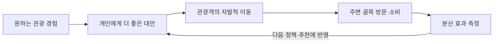
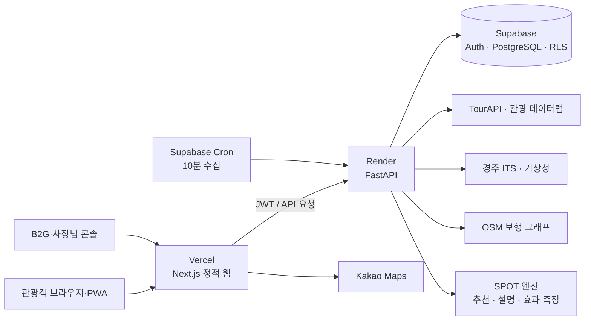

# NextSpot

[](https://github.com/NextSpot-knu/NextSpot/actions/workflows/ci.yml)
[](./apps/web)
[](./apps/api)

> 붐비는 경주에서, 취향과 상황에 맞는 **다음 장소**를 찾습니다.

**NextSpot**은 경주 황리단길의 관광 수요를 주변 골목과 대안 장소로 분산하는 AI 추천 서비스입니다.
한국관광공사 관광 데이터, 경주 ITS 주차 수요, 실제 보행 경로, 사용자 취향과 제휴 혜택을
**SPOT(Smart Place Optimization for Tourism)** 점수로 결합해 “지금 어디로 이동하면 좋은지”를 설명 가능한 형태로 제안합니다.

[🌐 서비스 체험](https://nextspot-nu.vercel.app) ·
[📘 API 문서](https://nextspot-api.onrender.com/docs) ·
[🟢 API 상태](https://nextspot-api.onrender.com/health)

> **2026 관광데이터 활용 공모전 · 웹/앱 개발 부문 출품작**
>
> 마지막 문서 갱신: **2026-08-27**

---

## 핵심 목적과 철학

황리단길의 혼잡은 단순히 관광지가 부족해서 생기는 문제가 아닙니다.
처음 경주를 찾은 관광객에게는 실패하지 않을 선택지가 첨성대·대릉원·황리단길 같은 유명 장소 몇 곳으로 보이고,
그 선택이 반복되면서 관광 수요와 소비가 같은 동선에 집중됩니다.

**NextSpot의 목적은 관광객이 원한 경험을 포기시키지 않으면서, 그 경험을 주변의 다른 장소에서도 이어가게 만드는 것입니다.**
한옥 카페를 원한 사람에게 단순히 “덜 붐비는 곳”을 보내는 것이 아니라,
같은 분위기·취향 적합도·실제 이동시간·혜택을 함께 비교해 **그 사람에게 더 좋은 선택**을 만듭니다.

**관광 분산은 통제나 희생이 아니라, 더 매력적인 선택에서 시작해야 합니다.**
관광객이 자신의 이익 때문에 자발적으로 이동할 때 지역 상인은 새로운 방문 기회를 얻고,
관광기관은 규제 없이 수요를 분산하며, 지역 주민은 한곳에 집중되는 관광 부담을 덜 수 있습니다.


```mermaid
flowchart LR
    A[원하는 관광 경험] --> B[개인에게 더 좋은 대안]
    B --> C[관광객의 자발적 이동]
    C --> D[주변 골목 방문·소비]
    D --> E[분산 효과 측정]
    E -->|다음 정책·추천에 반영| B
```

## 지금 구현된 제품

NextSpot은 관광객 앱 하나에 머물지 않고, 관광객의 선택이 지역 운영으로 이어지는 세 개의 화면을 제공합니다.

| 제품 | 주요 사용자 | 구현된 기능 |
| --- | --- | --- |
| **관광객 앱** | 경주 방문객 | 취향 온보딩, 지도·검색, 유명 명소 기반 대안 탐색, SPOT Top 3 비교, 음성 제어, 다중 경유 코스, 저장·쿠폰·여행 임팩트 |
| **B2G 관제** | 지자체·관광기관 | 실시간 수요 지도, 추천 퍼널·분산 효과, 지역별 성과 분석, POI·쿠폰 정책, 안전·문의 관리 |
| **사장님 콘솔** | 지역 상인 | 내 매장 지표, 시간대별 수요 전망, 쿠폰 발급·사용 성과, 타임세일 운영 브리핑 |

관광객 앱은 한국어·영어·일본어·중국어를 지원하며, PWA 설치와 오프라인 복원,
경주 현지 시각 기준 자동 야간 테마를 제공합니다.

## 핵심 기능

> **원하는 경험을 찾고 → 더 나은 대안을 고르고 → 실제로 이동하고 → 그 결과가 다음 추천과 도시 운영으로 이어집니다.**

### 1. 원하는 장소가 아니라 ‘원하는 경험’에서 출발

관광객이 첨성대 야경, 월정교 산책, 황리단길 한옥 카페처럼 기대하는 경험을 선택하면
장소 유형·테마·소개·관광 연관성을 분석해 같은 매력을 가진 주변 후보를 찾습니다.
유명 장소를 빼고 아무 곳이나 추천하는 것이 아니라, **관광객이 왜 그곳에 가고 싶었는지를 보존한 대안**을 만듭니다.

### 2. 도착 시점 기준으로 대안 Top 3 비교

현재 위치에서 각 후보까지의 OpenStreetMap 보행 경로로 실제 이동시간과 도착 예상 시각을 계산합니다.
그 시점의 지역 수요, 영업정보, 날씨·축제 맥락에 취향과 쿠폰 혜택을 더해 SPOT 점수를 만들고,
관광객은 후보별 차이와 추천 이유를 한 화면에서 비교합니다.

### 3. 추천을 실제 이동까지 끊김 없이 연결

“첨성대 근처 한적한 카페”처럼 말하거나 검색하면 대안 탐색이 시작됩니다.
음성으로 추천 사유 확인·수락·거절·다음 후보 전환이 가능하고, 선택하면 쿠폰이 발급되며
Kakao 길안내가 바로 열립니다. **발견에서 끝나는 추천이 아니라 실제 방문으로 이어지는 여정**입니다.

### 4. 한 장소를 넘어 여행 동선 전체를 분산

카페·관광지·문화시설 등 원하는 방문 순서를 고르면 구간별 이동시간과 체류시간을 누적해
2~3개 정류지의 코스를 구성합니다. 지도와 타임라인으로 도착 흐름을 확인하고 일행에게 공유할 수 있어,
한 번의 대안 선택이 자연스럽게 주변 지역을 경험하는 여행으로 확장됩니다.

### 5. 사용할수록 개인에게 더 맞는 선택

첫 방문에는 온보딩 취향으로 추천을 시작하고, 이후 수락(+10%)과 거절(-5%)이
8차원 선호 벡터를 즉시 갱신합니다. 익명으로 시작한 기록도 이메일 계정으로 이어져
저장 장소·쿠폰·방문 기록과 함께 다음 추천을 더 정교하게 만듭니다.

### 6. 관광객의 선택을 지역 운영 데이터로 연결

추천 스냅샷을 기준으로 수락·길안내·도착 확인·평가를 연결합니다.
관광객은 쿠폰과 개인 여행 임팩트를 확인하고, 관광기관은 같은 흐름에서 추천 수락률·재배치 건수·분산 효과를 봅니다.
상인은 타임세일과 혜택을 조정해 다음 추천에 참여하면서 세 사용자 화면이 하나의 순환 구조를 만듭니다.

한국어·영어·일본어·중국어, 음성 인터페이스, PWA 설치, 경주 현지 시각 기반 자동 야간 테마를 지원해
관광객이 걷는 순간에도 바로 사용할 수 있습니다.

## 핵심 경쟁력

> **지도 앱은 “어디가 있는지”를 알려주고, 웨이팅 앱은 “얼마나 기다리는지”를 알려줍니다.**
>
> **NextSpot은 “지금 어디를 선택해야 나와 지역 모두에게 더 좋은지”를 결정합니다.**

### 1. 공익을 위해 관광객에게 양보를 요구하지 않습니다

“유명지는 붐비니 다른 곳으로 가세요”라는 메시지만으로는 사람의 행동이 바뀌지 않습니다.
NextSpot은 같은 경험, 더 적은 이동 부담, 개인 취향과 쿠폰 혜택을 함께 제시해
주변 장소가 관광객 자신의 기준에서도 더 매력적인 선택이 되게 합니다.
**개인의 만족이 먼저 성립하기 때문에 분산이 자발적이고 지속될 수 있습니다.**

### 2. 개인의 선택과 도시의 목표를 같은 점수로 정렬합니다

SPOT은 `0.40 × 취향 − 0.40 × 시간비용 + 0.20 × 인센티브`로 후보를 평가합니다.
관광객에게는 잘 맞고 이동 부담이 적은 장소가, 상인에게는 혜택을 알릴 수 있는 기회가,
도시에는 혼잡한 동선에서 주변 상권으로 수요를 옮길 수 있는 선택이 됩니다.
서로 따로 움직이던 세 이해관계를 **하나의 추천 순위 안에서 같은 방향으로 정렬**한 것이 핵심입니다.

### 3. 정보를 보여주는 데서 끝나지 않고 행동을 완성합니다

혼잡 지도만 보여주면 관광객은 다시 검색하고 비교해야 합니다. NextSpot은 같은 경험의 후보를 찾고,
도착 시점의 가치로 순위를 정하고, 쿠폰과 길안내까지 연결합니다.
핵심 산출물은 정보가 아니라 **관광객이 바로 실행할 수 있는 다음 선택**입니다.

### 4. 관제 정책이 실제 추천과 이동을 바꿉니다

관광기관의 쿠폰 정책과 상인의 타임세일은 별도 캠페인 페이지에 머물지 않고 다음 SPOT 추천에 반영됩니다.
추천 이후에는 수락·길안내·도착·쿠폰 사용 흐름이 성과 지표로 돌아옵니다.
따라서 관제 화면은 단순 현황판이 아니라 **수요를 보고 → 개입하고 → 행동 변화를 측정하는 운영 도구**가 됩니다.

### 5. 세 개의 제품이 사용할수록 강해지는 하나의 순환을 만듭니다

관광객의 선택과 피드백은 개인화와 지역 수요 데이터를 쌓고, 상인의 혜택은 대안의 매력을 높이며,
관광기관의 정책은 필요한 지역으로 선택을 유도합니다. 이 결과가 다시 추천과 정책을 개선하므로
관광객 앱·사장님 콘솔·B2G 관제가 각각의 화면이 아니라 **하나의 데이터 플라이휠**로 작동합니다.

심사 서사와 비즈니스 모델은 [`docs/contest/CONTEST_NARRATIVE.md`](./docs/contest/CONTEST_NARRATIVE.md)에서 자세히 설명합니다.

## 만드는 가치

> **한 명의 관광객이 유명 장소 대신 마음에 드는 주변 대안을 선택합니다.**
>
> **그 한 번의 선택이 관광객·상인·도시·주민에게 서로 연결된 가치를 만듭니다.**

예를 들어 황리단길 한옥 카페를 찾던 관광객이 NextSpot에서 같은 분위기의 도보권 대안을 발견하고
쿠폰과 추천 이유를 확인한 뒤 길안내를 시작합니다. 이 한 번의 행동에는 다음 네 가지 결과가 동시에 생깁니다.

| 누구에게 | 직접 생기는 변화 | 왜 가능한가 |
| --- | --- | --- |
| **관광객** | 원했던 분위기는 유지하면서 검색·대기·우회의 기회비용을 줄입니다. | 같은 경험을 기준으로 취향·도보시간·혜택을 비교하기 때문입니다. |
| **지역 상인** | 핵심 동선 밖의 매장도 실제 방문 후보가 되고 쿠폰 전환 성과를 확인합니다. | 매력과 혜택이 SPOT 추천 순위와 길안내에 직접 연결되기 때문입니다. |
| **관광기관** | 통제 대신 인센티브로 수요에 개입하고 재배치 결과를 측정합니다. | 정책 변경이 추천에 반영되고 수락·이동 결과가 다시 집계되기 때문입니다. |
| **지역 주민** | 관광객을 막지 않으면서 특정 골목에 집중되는 생활 부담을 완화합니다. | 방문과 소비가 주변의 여러 장소로 나뉘기 때문입니다. |

이 가치 구조는 사업 모델과도 그대로 연결됩니다.

- **B2C 관광객 앱**은 개인화 추천과 실제 행동 흐름을 만듭니다.
- **B2B 소상공인 제휴**는 쿠폰·타임세일로 대안의 매력을 높이고 방문 전환 성과를 제공합니다.
- **B2G 관제 라이선스**는 지자체와 관광기관이 수요를 운영하고 정책 효과를 측정하게 합니다.
- 축적된 지역 수요와 행동 성과는 **상권 리포트·지역 운영 API**로 확장할 수 있습니다.

**NextSpot은 관광객에게 희생을 요구하지 않고도, 개인의 더 나은 선택을 지역 전체의 더 나은 흐름으로 바꾸는 관광 수요 운영 플랫폼입니다.**

## SPOT 추천 엔진

```text
raw_score = 0.40 × preference
          - 0.40 × time_cost
          + 0.20 × incentive

incentive = 0.5 × coupon_strength
          + 0.5 × demand_relief

SPOT_Score = min-max normalize(raw_score)  # 0.0 ~ 1.0
```

- `preference`: 온보딩과 수락(+10%)/거절(-5%) 피드백으로 갱신되는 8차원 취향 벡터
- `time_cost`: 도착 시점 대기 근거 + 실제 보행시간 + 제한된 주변 수요 비용을 60분 기준으로 정규화
- `coupon_strength`: 할인율 20%를 상한으로 정규화한 제휴 혜택
- `demand_relief`: 혼잡한 원본 장소에서 더 여유로운 후보로 이동할 때의 분산 기여

SPOT 엔진은 사용자의 취향 벡터를 읽고, 실제 보행 경로로 도착 시각을 계산한 뒤,
지역 수요·관광 통계·축제·날씨·영업정보를 결합해 후보를 평가합니다. 추천 이후의 수락·거절·방문 결과는
다음 추천과 B2G 성과 지표로 이어집니다.

구현 정본은 [`apps/api/app/services/spot/score.py`](./apps/api/app/services/spot/score.py)이며,
프런트 공용 상수는 [`packages/shared-types/spot.ts`](./packages/shared-types/spot.ts)에 있습니다.
CI 패리티 테스트가 가중치 `0.40 / 0.40 / 0.20`의 불일치를 차단합니다.

## 데이터 활용

| 데이터 | 역할 | SPOT 활용 |
| --- | --- | --- |
| **한국관광공사 TourAPI** | 관광지·문화시설·음식점·카페, 상세 정보, 이미지, 무장애 정보, 축제 | 풍부한 대안 장소 후보군 구성 |
| **관광 데이터랩 API** | 관광지 일별 집중률, 실제 이동 기반 연관 관광지 | 미래 수요 맥락과 유사 경험 후보 발굴 |
| **경주시 ITS** | 반경 2km 공영주차 잔여면 | 10분 단위 지역 수요 흐름과 도착 시점 판단 |
| **OpenStreetMap** | 도보 네트워크 | 실제 보행 동선 기반 이동 비용 계산 |
| **Kakao** | 지도, 장소 ID·좌표·주소, 길찾기, 영업정보 | 탐색부터 현장 이동까지 연결 |
| **기상청 단기예보** | 경주 시간대별 날씨 | 실내외 장소 선택과 여행 맥락 개인화 |
| **Supabase** | 인증, 장소, 추천, 피드백, 방문 결과 | 개인화 학습과 관광 수요 분산 성과 연결 |

TourAPI 엔드포인트별 매핑과 데이터 흐름은 [`docs/contest/DATA_UTILIZATION.md`](./docs/contest/DATA_UTILIZATION.md)를 참고하세요.

## 아키텍처


```mermaid
flowchart LR
    U[관광객 브라우저·PWA] --> W[Vercel<br/>Next.js 정적 웹]
    G[B2G·사장님 콘솔] --> W
    W -->|JWT / API 요청| A[Render<br/>FastAPI]

    A --> S[(Supabase<br/>Auth · PostgreSQL · RLS)]
    A --> T[TourAPI · 관광 데이터랩]
    A --> I[경주 ITS · 기상청]
    A --> O[OSM 보행 그래프]
    W --> K[Kakao Maps]

    C[Supabase Cron<br/>10분 수집] --> A
    A --> E[SPOT 엔진<br/>추천 · 설명 · 효과 측정]
```

```text
NextSpot/
├── apps/
│   ├── web/                  # Next.js 관광객 앱 + B2G 관제 + 사장님 콘솔
│   └── api/                  # FastAPI 추천·데이터·인증 API
├── packages/shared-types/    # SPOT 상수 단일 정의점 (web ↔ api 패리티)
├── supabase/migrations/      # DB 스키마 정본
├── scripts/                  # 저장소 도구(node) — 스키마 생성 · 문서/i18n 검사 · 테스트 러너
├── docs/                     # 운영 문서 · contest/ 심사 자료 · archive/ (색인 docs/README.md)
└── .github/workflows/        # CI · TourAPI 적재 · 모델 학습 · 수집/헬스체크 수동 복구
```

> 📍 **폴더 구조·전 기능·연결관계의 상세 정본은 [`docs/SYSTEM_MAP.md`](./docs/SYSTEM_MAP.md)** —
> 화면↔API↔서비스↔테이블 전수 매핑, SPOT 파이프라인, 추천·운영·성과 연결 구조.

## 기술 스택

| 영역 | 기술 |
| --- | --- |
| Web | Next.js 16.3.1, React 19, TypeScript 5, Tailwind CSS 4, Recharts, Framer Motion, Playwright |
| API | FastAPI, Python 3.11, Pydantic, scikit-learn, Ruff, Pytest |
| Data | Supabase Auth/PostgreSQL/RLS/Storage/Cron, 한국관광공사 API, 경주 ITS, 기상청 API |
| Map | Kakao Maps SDK, Kakao Local, OpenStreetMap 보행 그래프 |
| AI | 자체 SPOT 엔진, Upstage Solar 음성 의도 분류·운영 브리핑, 선호 벡터 학습 |
| Deploy | Vercel, Render, GitHub Actions |

## 로컬에서 실행하기

### 요구사항

- Node.js **20 이상** (`22` 권장, CI 기준)
- Python **3.11**
- Supabase 프로젝트
- 선택: Kakao Maps/Local, TourAPI, 기상청 API 키

### 1. 설치

```powershell
git clone https://github.com/NextSpot-knu/NextSpot.git
cd NextSpot

npm ci
py -3.11 -m venv apps/api/.venv
.\apps\api\.venv\Scripts\python.exe -m pip install -r apps/api/requirements.txt -r apps/api/requirements-dev.txt
```

### 2. 환경변수

```powershell
Copy-Item apps/api/.env.example apps/api/.env
Copy-Item apps/web/.env.example apps/web/.env.local
```

두 파일에서 최소한 다음 값을 설정합니다.

```text
apps/api/.env
  SUPABASE_URL
  SUPABASE_ANON_KEY
  SUPABASE_SERVICE_ROLE_KEY
  JWT_SECRET
  ADMIN_API_TOKEN

apps/web/.env.local
  NEXT_PUBLIC_SUPABASE_URL
  NEXT_PUBLIC_SUPABASE_ANON_KEY
  NEXT_PUBLIC_KAKAO_MAPS_APP_KEY
  NEXT_PUBLIC_FASTAPI_URL=http://localhost:8000
```

새 Supabase 프로젝트는 `supabase/RESET_AND_SETUP.sql`을 한 번 실행합니다.
기존 프로젝트는 `supabase/migrations/`를 순서대로 적용합니다.

> `NEXT_PUBLIC_*` 값은 브라우저 번들에 포함됩니다. 비밀키를 넣지 마세요.

### 3. 실행

```powershell
.\run_local.ps1
```

- Web: <http://localhost:3000>
- API: <http://localhost:8000>
- Swagger UI: <http://localhost:8000/docs>

Windows 외 환경의 개별 실행법, Docker, DB 설정과 스모크 테스트는 [`docs/LOCAL_RUN.md`](./docs/LOCAL_RUN.md)를 참고하세요.

## 품질 게이트

```powershell
# Web
npm run lint --workspace=apps/web
npm run typecheck --workspace=apps/web
npm run test --workspace=apps/web
npm run build --workspace=apps/web

# API (apps/api에서 실행)
cd apps/api
python -m ruff check .
python -m pytest -q

# E2E (저장소 루트에서 실행)
cd ../..
npm run test:e2e --workspace=apps/web

# DB 스키마 정합성
node scripts/build_reset.mjs
git diff --exit-code supabase/RESET_AND_SETUP.sql
```

GitHub Actions는 Web lint·typecheck·unit·build, API Ruff·Pytest, DB 스키마 패리티,
Chromium 모바일·4개 언어 E2E를 검증합니다.

## 품질과 운영 기반

- **자동 검증** — Web lint·typecheck·unit·build, API Ruff·Pytest, DB 스키마 패리티와 모바일 E2E를 CI에서 실행합니다.
- **계정 연속성** — 익명 사용 기록을 회원 계정으로 트랜잭션 병합해 첫 방문부터 재방문까지 개인화를 이어갑니다.
- **데이터 보호** — Supabase RLS와 JWT 인증으로 사용자별 데이터를 분리하고, 서버 쓰기는 FastAPI를 통해 처리합니다.
- **다국어 품질** — 한국어·영어·일본어·중국어 키 패리티와 실제 모바일 여정을 자동 검사합니다.

배포 환경변수와 운영 체크리스트는 [`docs/DEPLOY_AND_ENV.md`](./docs/DEPLOY_AND_ENV.md)를 참고하세요.

## 문서 지도

전체 문서 목록과 상태는 [`docs/README.md`](./docs/README.md)에 있습니다. 처음이라면
[`AGENTS.md`](./AGENTS.md) → [`docs/HANDOVER.md`](./docs/HANDOVER.md) → [`docs/SYSTEM_MAP.md`](./docs/SYSTEM_MAP.md) 순서로 읽으세요.

## 확장 방향

서비스 지역 좌표·경계·프리셋은 [`apps/web/lib/region.ts`](./apps/web/lib/region.ts)에 모았고, 적재 기준 좌표는
`apps/api/scripts/ingest_tourapi.py --lat/--lng`로 바꿉니다.
TourAPI 적재 스크립트의 기준 좌표를 바꾸고 지역 팩을 교체하는 방식으로 전주 한옥마을,
부산 감천문화마을 등 다른 오버투어리즘 지역으로 확장할 수 있습니다.

| 단계 | 기간 | 목표 |
| --- | --- | --- |
| **경주 MVP** | 2026.05 ~ 09 | 황리단길 공개 웹앱, 공공데이터 파이프라인, SPOT 추천, 관광객·관제·상인 폐루프 |
| **경북 확장** | 2026 ~ 2028 | 경북 관광 밀집 구역 5곳, RTO 실증, 제휴 쿠폰 운영 |
| **전국 확장** | 2029 ~ | 오버투어리즘 핫스팟 30곳, 지자체 관제 라이선스 |

---

**팀 Next Spot** · 서진석(PM/기획) · 오윤성(AI/Backend) · 정동기(Frontend) · 김승용(Data/Infra)

프로젝트는 산업단지 혼잡 분산 플랫폼 InduSpot의 SPOT 엔진과 모노레포 구조를 시드로 삼아,
TourAPI와 경주 관광 도메인에 맞게 전면 재구성했습니다. 피벗 기록은
[`docs/archive/NEXTSPOT_PIVOT.md`](./docs/archive/NEXTSPOT_PIVOT.md)에 남겨두었습니다.
