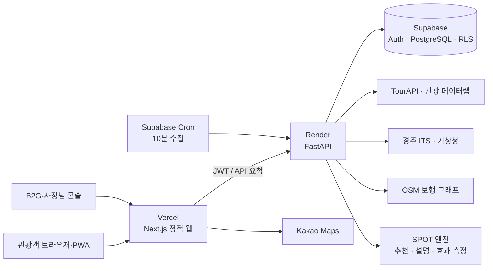

# NextSpot

[](https://github.com/NextSpot-knu/NextSpot/actions/workflows/ci.yml)
[](./apps/web)
[](./apps/api)

> 붐비는 경주에서, 취향과 상황에 맞는 **다음 장소**를 찾습니다.

**NextSpot**은 경주 황리단길의 관광 수요를 주변 골목과 대안 장소로 분산하는 AI 추천 서비스입니다.
한국관광공사 관광 데이터, 경주 ITS 주차 수요, 실제 보행 경로, 사용자 취향과 제휴 혜택을
**SPOT(Smart Place Optimization for Tourism)** 점수로 결합해 “지금 어디로 이동하면 좋은지”를 설명 가능한 형태로 제안합니다.

[🌐 서비스 체험](https://nextspot-nu.vercel.app) ·
[📘 API 문서](https://nextspot-api.onrender.com/docs) ·
[🟢 API 상태](https://nextspot-api.onrender.com/health)

> **2026 관광데이터 활용 공모전 · 웹/앱 개발 부문 출품작**
>
> 마지막 문서 갱신: **2026-08-27**

---

## 지금 구현된 제품

NextSpot은 관광객 앱 하나에 머물지 않고, 관광객의 선택이 지역 운영으로 이어지는 세 개의 화면을 제공합니다.

| 제품 | 주요 사용자 | 구현된 기능 |
| --- | --- | --- |
| **관광객 앱** | 경주 방문객 | 취향 온보딩, 지도·검색, 유명 명소 기반 대안 탐색, SPOT Top 3 비교, 음성 제어, 다중 경유 코스, 저장·쿠폰·여행 임팩트 |
| **B2G 관제** | 지자체·관광기관 | 실시간 수요 지도, 추천 퍼널·분산 효과, 지역별 성과 분석, POI·쿠폰 정책, 안전·문의 관리 |
| **사장님 콘솔** | 지역 상인 | 내 매장 지표, 시간대별 수요 전망, 쿠폰 발급·사용 성과, 타임세일 운영 브리핑 |

관광객 앱은 한국어·영어·일본어·중국어를 지원하며, PWA 설치와 오프라인 복원,
경주 현지 시각 기준 자동 야간 테마를 제공합니다.

## 핵심 기능

> **“가고 싶던 곳이 붐빈다”에서 끝내지 않고, “그래서 지금 어디로 갈까”까지 해결합니다.**

1. **핫플과 같은 경험을, 새로운 장소에서**

   첨성대·월정교·황리단길 한옥 카페처럼 관광객이 기대하는 대표 경험을 출발점으로 삼습니다.
   장소 유형, 테마, 소개와 관광 연관성을 분석해 같은 매력을 가진 주변 대안을 찾고,
   실제 도보시간과 혜택이 포함된 Top 3로 비교합니다.

2. **지금이 아니라 ‘내가 도착할 때’ 가장 좋은 장소**

   현재 위치에서 후보까지의 OpenStreetMap 보행 경로를 계산해 도착 예상 시각을 먼저 구합니다.
   여기에 경주 ITS 지역 수요, 관광 통계, 영업정보, 날씨와 축제 맥락을 결합해
   지금 출발했을 때 가장 합리적인 다음 장소를 SPOT 점수로 제안합니다.

3. **말 한마디가 실제 이동으로 이어지는 음성 AI 여정**

   “첨성대 근처 한적한 카페”, “양식 먹고 싶어”, “다음 장소 보여줘” 같은 자연어로 추천을 탐색합니다.
   추천 사유 확인, 수락·거절, 다음 후보 전환을 음성으로 제어하고,
   선택 즉시 쿠폰을 발급해 Kakao 길안내까지 연결합니다.

4. **한 장소 추천을 넘어, 여행 동선 전체 설계**

   카페·관광지·문화시설 등 원하는 순서를 고르면 이동시간과 체류시간을 누적해
   2~3개 정류지의 분산 코스를 구성합니다. 지도와 타임라인으로 전체 동선을 확인하고,
   공유 링크를 통해 일행과 같은 코스를 바로 열 수 있습니다.

5. **첫 방문부터 시작되고, 쓸수록 깊어지는 개인화**

   온보딩에서 고른 취향만으로 첫 추천을 시작하고, 수락(+10%)과 거절(-5%)이
   8차원 선호 벡터를 즉시 갱신합니다. 익명으로 가볍게 시작한 기록은 이메일 계정으로 합쳐져
   저장 장소, 쿠폰, 방문 기록과 함께 다음 여행까지 이어집니다.

6. **추천 이후까지 닫히는 여행 경험**

   추천 스냅샷을 기준으로 수락→길안내→도착 확인→평가를 연결하고, 현장 제보는 장소 운영정보에 반영합니다.
   관광객은 마이페이지에서 쿠폰과 개인 여행 임팩트를 확인하고,
   같은 흐름은 관광기관의 수락률·재배치·분산 효과 지표로 집계됩니다.

한국어·영어·일본어·중국어, 음성 인터페이스, PWA 설치, 경주 현지 시각 기반 자동 야간 테마를 지원해
관광객이 걷는 순간에도 바로 사용할 수 있습니다.

## 핵심 경쟁력

> **지도 앱은 장소를 찾고, 웨이팅 앱은 줄을 보여줍니다.**
>
> **NextSpot은 관광객의 ‘다음 선택’을 바꿔 도시의 수요 흐름을 움직입니다.**

### 1. 혼잡 정보 서비스가 아니라 수요 재배치 엔진

대부분의 지도·혼잡 서비스는 사용자가 보고 판단할 정보를 제공하는 데서 끝납니다.
NextSpot은 포화 장소와 비슷한 경험을 제공하는 대안을 직접 선별하고, 비교 가능한 Top 3와 이동 경로를 제시해
관광객의 실제 선택을 주변 골목으로 전환합니다. 핵심 산출물이 ‘혼잡도’가 아니라 **실행 가능한 다음 행동**이라는 점이 다릅니다.

### 2. ‘현재 혼잡’이 아니라 ‘도착 시점의 가치’를 계산

관광객이 지도를 보는 시각과 장소에 도착하는 시각은 다릅니다. NextSpot은 실제 보행시간을 먼저 계산하고,
그 도착 시각을 기준으로 취향 일치도, 시간 비용, 지역 수요와 혜택을 평가합니다.
따라서 가까워 보이는 장소가 아니라 **도착했을 때 더 나은 경험을 줄 장소**가 상위에 올라갑니다.

### 3. 관광객·소상공인·도시의 이익을 하나의 SPOT 산식에

`0.40 × 취향 − 0.40 × 시간비용 + 0.20 × 인센티브` 구조 안에
관광객의 만족과 기회비용, 소상공인의 쿠폰 혜택, 도시의 수요 분산 기여를 함께 담았습니다.
개인에게 좋은 추천이 지역 상권과 공공의 목표에도 기여하도록 **추천 순위 자체에 상생 구조를 설계**했습니다.

### 4. 정책이 보고서에 머물지 않고 다음 추천을 바꿈

관광기관이 특정 지역이나 제휴 장소의 쿠폰 정책을 조정하고, 상인이 타임세일을 열면
그 변화가 별도의 모델 재학습 없이 다음 추천부터 반영됩니다. 관제 대시보드는 단순 모니터링 화면이 아니라
**수요를 보고 → 개입하고 → 추천 행동을 바꾸는 실행 도구**입니다.

### 5. 추천의 끝을 클릭이 아니라 지역 성과로 측정

추천 노출에서 수락, 길안내, 도착 확인, 쿠폰 사용까지 하나의 흐름으로 연결합니다.
관광기관은 추천 수락률, 재배치 건수, 쿠폰 전환과 분산 효과를 확인하고 다음 정책에 다시 반영할 수 있습니다.
이 **관제→개입→행동→측정 폐루프**가 관광객 앱·사장님 콘솔·B2G 관제를 하나의 플랫폼으로 묶습니다.

### 6. 경주에서 검증하고 다른 관광 밀집 지역으로 확장

지역 중심 좌표, 경계, 대표 관광지와 추천 프리셋을 지역 팩으로 분리했습니다.
SPOT 엔진과 TourAPI 파이프라인은 유지하면서 지역 데이터와 보행 그래프를 교체할 수 있어,
전주 한옥마을·부산 감천문화마을 등 다른 오버투어리즘 지역으로 같은 운영 모델을 확장할 수 있습니다.

심사 서사와 비즈니스 모델은 [`docs/CONTEST_NARRATIVE.md`](./docs/CONTEST_NARRATIVE.md)에서 자세히 설명합니다.

## 만드는 가치

> **관광객 한 명의 다음 선택이 바뀌면, 골목의 수요 흐름과 지역의 소비 동선이 함께 바뀝니다.**

### 관광객 — 기다리는 시간을 여행하는 시간으로

유명 장소의 혼잡을 확인한 뒤 다시 검색하게 만드는 대신, 취향과 현재 상황에 맞는 대안을 즉시 제안합니다.
관광객은 검색·대기·우회에 쓰던 기회비용을 줄이고, 원래 기대했던 분위기와 경험을 포기하지 않으면서
새로운 장소와 골목을 발견할 수 있습니다.

### 지역 상인 — 입지가 아니라 매력과 혜택으로 발견되는 구조

핵심 관광 동선에서 조금 벗어난 매장도 카테고리, 메뉴, 분위기, 실제 보행거리와 쿠폰 혜택을 바탕으로 추천됩니다.
상인은 할인율과 타임세일로 유휴 시간대의 수요를 유도하고, 쿠폰 발급·사용과 추천 전환 지표로
제휴가 실제 방문으로 이어졌는지 확인할 수 있습니다.

### 관광기관 — 사후 관제에서 실시간 수요 운영으로

혼잡이 발생한 뒤 안내 방송이나 통제에 의존하는 대신, 지역 수요를 보면서 인센티브 정책을 조정하고
관광객의 다음 선택에 개입할 수 있습니다. 이후 수락·이동·방문 데이터를 통해 정책이 만든 재배치 성과를 측정해
다음 운영 의사결정으로 연결합니다.

### 지역사회 — 관광 만족도는 유지하고, 체류와 소비는 넓게

인기 장소의 방문을 막는 방식이 아니라 비슷한 매력을 가진 주변 대안을 발견시키는 방식이므로
관광객의 만족을 해치지 않으면서 특정 골목에 집중되는 생활 부담을 낮출 수 있습니다.
동시에 방문과 소비가 주변 상권으로 확산돼 지역 안에서 관광의 편익을 더 넓게 나눕니다.

### 사업화 — 하나의 추천 엔진에서 B2B와 B2G로 확장

관광객용 개인화 추천이 사용과 행동 데이터를 만들고, 소상공인 제휴·쿠폰은 더 매력적인 대안과 수익을 만듭니다.
관광기관은 이 흐름을 운영하는 B2G 관제 라이선스와 지역 성과 리포트를 활용할 수 있습니다.
이를 **개인화 추천(B2C) → 제휴·타임세일(B2B) → 관제 SaaS·지역 리포트(B2G)**로 연결해
사용자가 늘수록 추천 매력, 상권 참여와 정책 효과가 함께 커지는 성장 구조를 설계했습니다.

**NextSpot은 장소 추천 앱이 아니라, 관광 수요를 설계하고 실행하며 성과까지 측정하는 지역 관광 운영 플랫폼입니다.**

## SPOT 추천 엔진

```text
raw_score = 0.40 × preference
          - 0.40 × time_cost
          + 0.20 × incentive

incentive = 0.5 × coupon_strength
          + 0.5 × demand_relief

SPOT_Score = min-max normalize(raw_score)  # 0.0 ~ 1.0
```

- `preference`: 온보딩과 수락(+10%)/거절(-5%) 피드백으로 갱신되는 8차원 취향 벡터
- `time_cost`: 도착 시점 대기 근거 + 실제 보행시간 + 제한된 주변 수요 비용을 60분 기준으로 정규화
- `coupon_strength`: 할인율 20%를 상한으로 정규화한 제휴 혜택
- `demand_relief`: 혼잡한 원본 장소에서 더 여유로운 후보로 이동할 때의 분산 기여

SPOT 엔진은 사용자의 취향 벡터를 읽고, 실제 보행 경로로 도착 시각을 계산한 뒤,
지역 수요·관광 통계·축제·날씨·영업정보를 결합해 후보를 평가합니다. 추천 이후의 수락·거절·방문 결과는
다음 추천과 B2G 성과 지표로 이어집니다.

구현 정본은 [`apps/api/app/services/spot/score.py`](./apps/api/app/services/spot/score.py)이며,
프런트 공용 상수는 [`packages/shared-types/spot.ts`](./packages/shared-types/spot.ts)에 있습니다.
CI 패리티 테스트가 가중치 `0.40 / 0.40 / 0.20`의 불일치를 차단합니다.

## 데이터 활용

| 데이터 | 역할 | SPOT 활용 |
| --- | --- | --- |
| **한국관광공사 TourAPI** | 관광지·문화시설·음식점·카페, 상세 정보, 이미지, 무장애 정보, 축제 | 풍부한 대안 장소 후보군 구성 |
| **관광 데이터랩 API** | 관광지 일별 집중률, 실제 이동 기반 연관 관광지 | 미래 수요 맥락과 유사 경험 후보 발굴 |
| **경주시 ITS** | 반경 2km 공영주차 잔여면 | 10분 단위 지역 수요 흐름과 도착 시점 판단 |
| **OpenStreetMap** | 도보 네트워크 | 실제 보행 동선 기반 이동 비용 계산 |
| **Kakao** | 지도, 장소 ID·좌표·주소, 길찾기, 영업정보 | 탐색부터 현장 이동까지 연결 |
| **기상청 단기예보** | 경주 시간대별 날씨 | 실내외 장소 선택과 여행 맥락 개인화 |
| **Supabase** | 인증, 장소, 추천, 피드백, 방문 결과 | 개인화 학습과 관광 수요 분산 성과 연결 |

TourAPI 엔드포인트별 매핑과 데이터 흐름은 [`docs/DATA_UTILIZATION.md`](./docs/DATA_UTILIZATION.md)를 참고하세요.

## 아키텍처


```mermaid
flowchart LR
    U[관광객 브라우저·PWA] --> W[Vercel<br/>Next.js 정적 웹]
    G[B2G·사장님 콘솔] --> W
    W -->|JWT / API 요청| A[Render<br/>FastAPI]

    A --> S[(Supabase<br/>Auth · PostgreSQL · RLS)]
    A --> T[TourAPI · 관광 데이터랩]
    A --> I[경주 ITS · 기상청]
    A --> O[OSM 보행 그래프]
    W --> K[Kakao Maps]

    C[Supabase Cron<br/>10분 수집] --> A
    A --> E[SPOT 엔진<br/>추천 · 설명 · 효과 측정]
```

```text
NextSpot/
├── apps/
│   ├── web/                  # Next.js 관광객 앱 + B2G 관제 + 사장님 콘솔
│   └── api/                  # FastAPI 추천·데이터·인증 API
├── packages/shared-types/    # SPOT 상수와 프런트 공용 타입
├── supabase/migrations/      # DB 스키마 정본
├── scripts/                  # 적재·스키마 생성·운영 검증 도구
├── docs/                     # 데이터·모델·배포·공모전 문서
└── .github/workflows/        # CI, 데이터 적재, 운영 상태 확인
```

> 📍 **폴더 구조·전 기능·연결관계의 상세 정본은 [`docs/SYSTEM_MAP.md`](./docs/SYSTEM_MAP.md)** —
> 화면↔API↔서비스↔테이블 전수 매핑, SPOT 파이프라인, 추천·운영·성과 연결 구조.

## 기술 스택

| 영역 | 기술 |
| --- | --- |
| Web | Next.js 16.3.1, React 19, TypeScript 5, Tailwind CSS 4, Recharts, Framer Motion, Playwright |
| API | FastAPI, Python 3.11, Pydantic, scikit-learn, Ruff, Pytest |
| Data | Supabase Auth/PostgreSQL/RLS/Realtime/Cron, 한국관광공사 API, 경주 ITS, 기상청 API |
| Map | Kakao Maps SDK, Kakao Local, OpenStreetMap 보행 그래프 |
| AI | 자체 SPOT 엔진, Upstage Solar 음성 의도 분류·운영 브리핑, 선호 벡터 학습 |
| Deploy | Vercel, Render, GitHub Actions |

## 로컬에서 실행하기

### 요구사항

- Node.js **20 이상** (`22` 권장, CI 기준)
- Python **3.11**
- Supabase 프로젝트
- 선택: Kakao Maps/Local, TourAPI, 기상청 API 키

### 1. 설치

```powershell
git clone https://github.com/NextSpot-knu/NextSpot.git
cd NextSpot

npm ci
py -3.11 -m venv apps/api/.venv
.\apps\api\.venv\Scripts\python.exe -m pip install -r apps/api/requirements.txt -r apps/api/requirements-dev.txt
```

### 2. 환경변수

```powershell
Copy-Item apps/api/.env.example apps/api/.env
Copy-Item apps/web/.env.example apps/web/.env.local
```

두 파일에서 최소한 다음 값을 설정합니다.

```text
apps/api/.env
  SUPABASE_URL
  SUPABASE_ANON_KEY
  SUPABASE_SERVICE_ROLE_KEY
  JWT_SECRET
  ADMIN_API_TOKEN

apps/web/.env.local
  NEXT_PUBLIC_SUPABASE_URL
  NEXT_PUBLIC_SUPABASE_ANON_KEY
  NEXT_PUBLIC_KAKAO_MAPS_APP_KEY
  NEXT_PUBLIC_FASTAPI_URL=http://localhost:8000
```

새 Supabase 프로젝트는 `supabase/RESET_AND_SETUP.sql`을 한 번 실행합니다.
기존 프로젝트는 `supabase/migrations/`를 순서대로 적용합니다.

> `NEXT_PUBLIC_*` 값은 브라우저 번들에 포함됩니다. 비밀키를 넣지 마세요.

### 3. 실행

```powershell
.\run_local.ps1
```

- Web: <http://localhost:3000>
- API: <http://localhost:8000>
- Swagger UI: <http://localhost:8000/docs>

Windows 외 환경의 개별 실행법, Docker, DB 설정과 스모크 테스트는 [`LOCAL_RUN.md`](./LOCAL_RUN.md)를 참고하세요.

## 품질 게이트

```powershell
# Web
npm run lint --workspace=apps/web
npm run typecheck --workspace=apps/web
npm run test --workspace=apps/web
npm run build --workspace=apps/web

# API (apps/api에서 실행)
cd apps/api
python -m ruff check .
python -m pytest -q

# E2E (저장소 루트에서 실행)
cd ../..
npm run test:e2e --workspace=apps/web

# DB 스키마 정합성
node scripts/build_reset.mjs
git diff --exit-code supabase/RESET_AND_SETUP.sql
```

GitHub Actions는 Web lint·typecheck·unit·build, API Ruff·Pytest, DB 스키마 패리티,
Chromium 모바일·4개 언어 E2E를 검증합니다.

## 품질과 운영 기반

- **자동 검증** — Web lint·typecheck·unit·build, API Ruff·Pytest, DB 스키마 패리티와 모바일 E2E를 CI에서 실행합니다.
- **계정 연속성** — 익명 사용 기록을 회원 계정으로 트랜잭션 병합해 첫 방문부터 재방문까지 개인화를 이어갑니다.
- **데이터 보호** — Supabase RLS와 JWT 인증으로 사용자별 데이터를 분리하고, 서버 쓰기는 FastAPI를 통해 처리합니다.
- **다국어 품질** — 한국어·영어·일본어·중국어 키 패리티와 실제 모바일 여정을 자동 검사합니다.

배포 환경변수와 운영 체크리스트는 [`docs/DEPLOY_AND_ENV.md`](./docs/DEPLOY_AND_ENV.md)를 참고하세요.

## 문서 지도

| 문서 | 내용 |
| --- | --- |
| [`docs/HANDOVER.md`](./docs/HANDOVER.md) | 가장 최신 구현 상태와 운영 인계 |
| [`docs/SYSTEM_MAP.md`](./docs/SYSTEM_MAP.md) | 화면↔API↔서비스↔DB 전체 연결 관계 |
| [`docs/DATA_UTILIZATION.md`](./docs/DATA_UTILIZATION.md) | 공공데이터 엔드포인트와 SPOT 반영 근거 |
| [`docs/MODEL_CARD.md`](./docs/MODEL_CARD.md) | 예측 모델 평가와 운영 승격 체계 |
| [`docs/CONTEST_NARRATIVE.md`](./docs/CONTEST_NARRATIVE.md) | 공모전 핵심 서사와 비즈니스 모델 |
| [`docs/DEMO_SCENARIO.md`](./docs/DEMO_SCENARIO.md) | 관광객·관제 데모 시나리오 |
| [`docs/JUDGE_QA.md`](./docs/JUDGE_QA.md) | 예상 심사 질문과 답변 |
| [`docs/DEPLOY_AND_ENV.md`](./docs/DEPLOY_AND_ENV.md) | Vercel·Render·Supabase 배포 |

## 확장 방향

서비스 지역 좌표·경계·프리셋은 [`apps/web/lib/region.ts`](./apps/web/lib/region.ts)와 환경변수에 모았습니다.
TourAPI 적재 스크립트의 기준 좌표를 바꾸고 지역 팩을 교체하는 방식으로 전주 한옥마을,
부산 감천문화마을 등 다른 오버투어리즘 지역으로 확장할 수 있습니다.

| 단계 | 기간 | 목표 |
| --- | --- | --- |
| **경주 MVP** | 2026.05 ~ 09 | 황리단길 공개 웹앱, 공공데이터 파이프라인, SPOT 추천, 관광객·관제·상인 폐루프 |
| **경북 확장** | 2026 ~ 2028 | 경북 관광 밀집 구역 5곳, RTO 실증, 제휴 쿠폰 운영 |
| **전국 확장** | 2029 ~ | 오버투어리즘 핫스팟 30곳, 지자체 관제 라이선스 |

---

**팀 Next Spot** · 서진석(PM/기획) · 오윤성(AI/Backend) · 정동기(Frontend) · 김승용(Data/Infra)

프로젝트는 산업단지 혼잡 분산 플랫폼 InduSpot의 SPOT 엔진과 모노레포 구조를 시드로 삼아,
TourAPI와 경주 관광 도메인에 맞게 전면 재구성했습니다. 피벗 기록은
[`docs/NEXTSPOT_PIVOT.md`](./docs/NEXTSPOT_PIVOT.md)에 남겨두었습니다.
