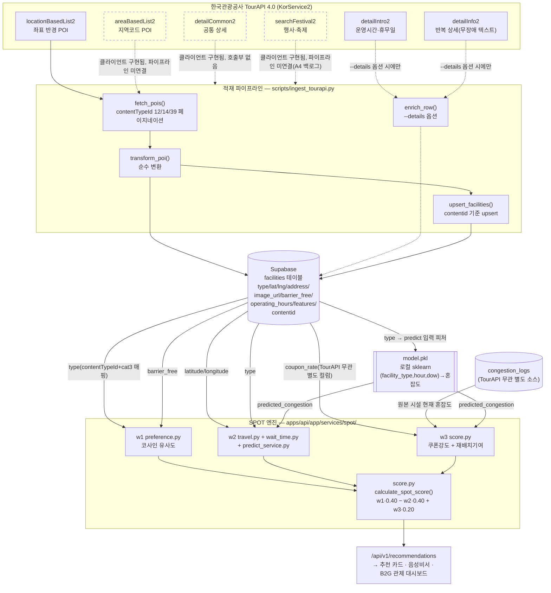

# 데이터 활용 명세 — TourAPI → SPOT 산식 변수 매핑

> 2026-07-09 작성. 목적: 2026 관광데이터 활용 공모전 서면심사 필수 항목
> **「한국관광공사 OpenAPI(TourAPI) 활용의 적절성」**을 심사위원이 코드 근거와 함께 즉시 확인하도록,
> "TourAPI를 쓴다"가 아니라 **TourAPI 각 필드가 SPOT 산식의 어느 변수에 어떻게 기여하는지**를
> 매핑한다. (관련 배점 대응 전략: `docs/CONTEST_STRATEGY.md` §2-A, 액션 A6)
>
> **정직성 고지**: 이 문서의 모든 서술은 실제 코드(`apps/api/app/services/tourapi/`,
> `apps/api/app/services/spot/`, `packages/shared-types/spot.ts`)에 근거한다. 존재하지 않는
> 엔드포인트·기능·수치는 기재하지 않는다. §2에서 현재 실행 상태를 가감 없이 밝힌다.

---

## 1. 현재 구현 상태 (정직 고지)

| 구성 요소 | 상태 | 근거 |
|---|---|---|
| TourAPI 비동기 클라이언트 (`client.py`, KorService2, 6개 엔드포인트 함수) | ✅ 구현 완료 | `apps/api/app/services/tourapi/client.py` |
| 응답→적재 행 변환 (`transform.py`, 순수 함수) | ✅ 구현 완료 + 단위테스트 | `apps/api/tests/services/test_tourapi.py` |
| 적재 배치 스크립트 (`scripts/ingest_tourapi.py`) | ✅ 구현 완료, **미실행** | `TOURAPI_KEY` 미설정 — 호출 시점에 한국어 `RuntimeError` 발생(`client.py:_require_key`), 부팅은 막지 않음 |
| Supabase 스키마 확장 | ✅ 적용 완료 | `supabase/migrations/20260707130000_add_tourapi_fields.sql` (contentid·contenttypeid·address·barrier_free·image_url + 부분 유니크 인덱스) |
| SPOT 엔진(w1/w2/w3) — TourAPI 파생 필드 소비 경로 | ✅ 구현 완료 | `apps/api/app/services/spot/{score,preference,wait_time}.py` |
| **DB 내 실데이터** | ⚠️ **TourAPI 실적재분 없음** | `supabase/RESET_AND_SETUP.sql`의 수기 시드 16건뿐. 전부 `contentid IS NULL` — TourAPI에서 온 행이 아니라 데모용 수기 좌표(황리단길 일대)다 |

**요약**: 클라이언트·변환·적재·스키마·SPOT 엔진 소비 경로까지 코드 경로는 전 구간 존재하고
단위테스트로 검증되어 있으나, 공공데이터포털 TourAPI(B551011) 활용신청 키(`TOURAPI_KEY`) 발급
대기로 `python scripts/ingest_tourapi.py` 실행 전이다. 즉 **"TourAPI 데이터가 SPOT 점수에
어떻게 반영되는가"는 코드로 확정**되어 있고, **"실제로 몇 건이 반영되었는가"는 키 수령 후
1회 배치 실행으로 채워질 예정**이다(§6 실행 방법 참고). 아래 매핑은 실행 여부와 무관하게
"들어오면 이렇게 흐른다"는 구현된 경로를 기술한다.

---

## 2. 데이터 흐름 다이어그램



범례: 실선 = 코드로 연결되어 실행 가능한 경로(키 수령 시 즉시 동작). 점선 = 클라이언트
함수는 구현되어 있으나 파이프라인 호출부가 아직 없는 경로(§5 참고).

---

## 3. TourAPI 엔드포인트 → SPOT 산식 변수 매핑 표

SPOT 종합 스코어: `score = w1·preference − w2·time_cost + w3·incentive` (Min-Max 정규화),
`w1=0.40 / w2=0.40 / w3=0.20` — `apps/api/app/services/spot/score.py` (`packages/shared-types/spot.ts`와
CI 패리티 테스트로 정합 강제).

| 엔드포인트 | TourAPI 제공 필드 | 적재 컬럼 / features | SPOT 산식 기여 경로 | 기여 변수 | 연결 상태 |
|---|---|---|---|---|---|
| **locationBasedList2** | `mapx`,`mapy`(경도/위도) | `facilities.latitude/longitude` | `spot/travel.py get_travel_time_and_distance()` → `travel_time_min` → `total_time = wait+travel` → `time_cost=min(1,total_time/60)` | **w2(시간)** | 연결됨(실행 대기) |
| locationBasedList2 | 위 좌표(동일 필드) | 동일 컬럼 | `routers/recommendations.py` — 사용자 위치 기준 반경 150m 이내만 후보군 채택(1차 필터) | 필터(후보 생성) | 연결됨 |
| locationBasedList2 | `contenttypeid`(12/14/39) + `cat3` | `map_facility_type()` → `facilities.type`(restaurant/cafe/attraction/culture) | `spot/preference.py CATEGORY_VECTORS[type]` → 사용자 벡터와 코사인 유사도 | **w1(선호)** | 연결됨 |
| locationBasedList2 | 위 `type`(동일) | 동일 | `spot/wait_time.py DEFAULT_PROCESSING_TIMES[type]` → 기본 처리시간 × 혼잡도 × 시간대 보정 = `predicted_wait` | **w2(시간)** | 연결됨 |
| locationBasedList2 | 위 `type`(동일) | 동일 | `predict_service.py predict_congestion(type, hour, dow)` 3피처 중 1(로컬 sklearn `model.pkl`) → `predicted_congestion` | **w2**(대기시간 산정 입력) 및 **w3**(재배치기여 성분) | 연결됨(모델 미학습 시 0.5 기본값 폴백) |
| locationBasedList2 | `title` | `facilities.name` | 추천 카드·목록 표시명 | 표시 | 연결됨 |
| locationBasedList2 | `contentid` | `facilities.contentid`(부분 유니크 인덱스) | `upsert_facilities()` 갱신 기준키(중복 적재 방지) | 식별자(산식 미기여) | 연결됨 |
| locationBasedList2 | `addr1` | `facilities.address` | 저장만 됨 | **미사용** | 적재 배선만 있음 — UI·산식 미참조(A2 백로그) |
| locationBasedList2 | `firstimage` | `facilities.image_url` | 저장만 됨 | **미사용** | 적재 배선만 있음 — UI 미참조(A2 백로그) |
| locationBasedList2 | `cat1`/`cat2`/`cat3` 원본 | `facilities.features.{cat1,cat2,cat3}`(JSONB) | 저장만 됨 | **미사용** | `preference.py`는 `features.barrier_free`/`features.instagrammable`만 읽음 — cat1-3은 아직 산식 미참조 |
| **areaBasedList2** | 지역코드(경북=35, 경주=2) 기반 POI 목록 | — | 클라이언트 함수(`area_based_list()`) 구현·export 완료 | — | **파이프라인 미연결** — `ingest_tourapi.py`는 현재 좌표 반경(`locationBasedList2`)만 호출 |
| **detailCommon2** | 개요·전화·홈페이지·대표이미지 등 공통 상세 | — | 클라이언트 함수(`detail_common()`) 구현·export 완료 | — | **호출부 없음** — 상세 카드 확장(A2 백로그) 시 사용 예정 |
| **detailIntro2** | `usetime`/`usetimeculture`/`opentimefood`(운영시간), `restdate`/`restdateculture`/`restdatefood`(휴무일) — contentTypeId별 필드명 상이 | `extract_operating_hours()` → `facilities.operating_hours`(JSONB) | 관리자 `FacilityTable.tsx`(`getHoursText`)에 표시 확인됨. SPOT 산식(w1/w2/w3)에는 미사용 | 표시(운영정보) | 연결됨, 단 `ingest_tourapi.py --details` 옵션 시에만 호출(쿼터 절약, 기본 꺼짐) |
| **detailInfo2** | `infoname`/`infotext` 반복 상세 텍스트 — "무장애","휠체어","장애인","배리어프리","베리어프리","엘리베이터" 키워드 판별 | `extract_barrier_free()` → `facilities.barrier_free`(BOOLEAN, NULL=미상) | `score.py`가 `barrier_free` 컬럼을 `features.barrier_free`로 브리지 → `preference.py`에서 시설 벡터 접근성 차원(`dim6 += 0.3`) 부스트 → 코사인 유사도 재계산 | **w1(선호)** | 연결됨(detail 필드 중 유일하게 산식까지 도달), `--details` 옵션 시에만 호출 |
| **searchFestival2** | 행사명·기간·장소 등 축제/행사 목록 | — | 클라이언트 함수(`search_festival()`) 구현·export 완료. 어떤 서비스·라우터도 호출하지 않음 | — | **파이프라인 완전 미연결** — "혼잡 예측 외부 변수"로 결합 예정(`CONTEST_STRATEGY.md` A4 백로그, 미착수) |

### w3(인센티브) 성분별 출처 — 중요 정정

`incentive = 0.5 · coupon_term + 0.5 · relief_term` (`INCENTIVE_COUPON_SHARE=0.5`, `score.py`)

- `relief_term = max(0, min(1, 원본혼잡 − 후보 도착시점 예측혼잡))` — 후보의 `predicted_congestion`은
  위 표대로 **TourAPI 파생 `type` 필드가 입력 피처로 간접 기여**한다.
- `coupon_term = min(1, coupon_rate/0.20)` — `coupon_rate`는 **TourAPI 제공 필드가 아니다.**
  `supabase/migrations/20260707150000_add_coupon_incentive.sql`로 별도 적재되는 내부 제휴 할인율
  컬럼이며, TourAPI 응답 어디에도 대응 필드가 없다. w3의 절반은 TourAPI와 무관함을 명시한다.

---

## 4. 요약 — 산식 변수별 TourAPI 기여도

| SPOT 변수 | 가중치 | TourAPI 기여 여부 | 기여 경로(요약) |
|---|---|---|---|
| w1 preference(선호 일치) | 0.40 | ✅ 기여 | `type`(contentTypeId+cat3) → 카테고리 벡터, `barrier_free`(detailInfo2) → 접근성 차원 보정 |
| w2 time_cost(시간 비용) | 0.40 | ✅ 기여 | `latitude/longitude` → 이동시간, `type` → 기본 처리시간·예측혼잡 입력 |
| w3 incentive(인센티브) | 0.20 | ⚠️ 절반만 기여 | `relief_term`(혼잡 재배치)은 `type` 경유로 간접 기여, `coupon_term`(쿠폰강도)은 TourAPI 무관 내부 데이터 |
| 후보 필터(반경 150m) | — | ✅ 기여 | `latitude/longitude` |
| 표시(이름·운영시간) | — | ✅ 기여(부분) | `title`→이름, `operating_hours`→관리자 테이블 표시. `address`/`image_url`은 적재만 되고 미표시 |

---

## 5. 아직 연결되지 않은 것 (정직한 백로그)

코드에 존재하지만 SPOT 산식·UI까지 도달하지 않은 항목. 과장 방지를 위해 명시한다.

1. **`areaBasedList2` / `detailCommon2`** — 클라이언트 함수는 구현·테스트 대상이지만, 어떤
   라우터·스크립트도 호출하지 않는다. 현재 적재는 좌표 반경 방식(`locationBasedList2`)만으로
   충분하다고 판단해 보류했다.
2. **`searchFestival2`** — "혼잡 예측 외부 변수(행사 보정)"로 결합할 계획(`CONTEST_STRATEGY.md`
   §2-A A4)이나 아직 미착수. 현재 `predict_congestion()`은 `[type, hour, dow]` 3피처만 사용하며
   행사 유무는 입력되지 않는다.
3. **`address`(addr1) / `image_url`(firstimage)** — `facilities` 테이블에는 적재되나, 프런트
   추천 카드(`RecommendationCard.tsx`)는 현재 `features.address`(TourAPI 미기재 필드) 폴백값을
   쓰고 있어 실제 TourAPI 주소·이미지는 화면에 아직 노출되지 않는다(A2 백로그).
4. **`cat1`/`cat2`/`cat3`** — `features` JSONB에 원본값이 보존되나, `preference.py`는
   `features.barrier_free`/`features.instagrammable`만 읽어 아직 산식 세분화에 쓰이지 않는다.

---

## 6. 재현 방법 (심사 검증용)

```bash
# 변환 로직만 검증 — Supabase 기록 없이 TourAPI 응답→행 변환 결과만 출력
python apps/api/scripts/ingest_tourapi.py --dry-run

# 실제 적재 (TOURAPI_KEY 설정 후) — 황리단길 반경 2km, 관광지/문화시설/음식점
python apps/api/scripts/ingest_tourapi.py

# 상세(운영시간·무장애)까지 포함 — POI당 2회 추가 호출(쿼터 소모 큼, 기본 꺼짐)
python apps/api/scripts/ingest_tourapi.py --details --limit 20
```

단위테스트: `apps/api/tests/services/test_tourapi.py`(변환 순수함수),
`apps/api/tests/services/test_spot.py`(SPOT 산식·`spot.ts` 패리티).

---

_이 문서는 서면 심사 제출용 데이터 활용 명세다. 실적재 완료·상세 카드 UI 반영 등 §5 백로그가
진척되면 본 문서와 매핑 표를 함께 갱신한다._
