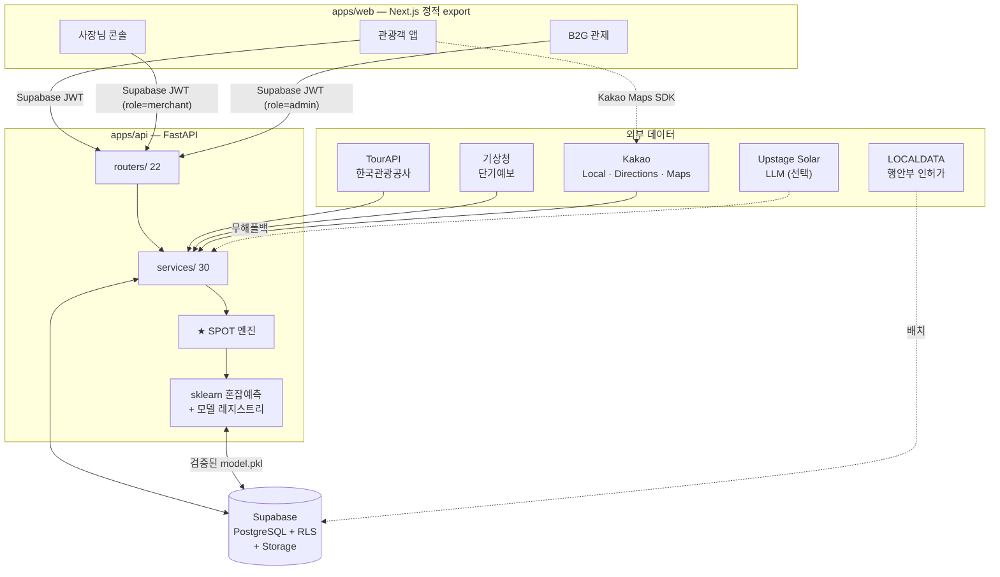
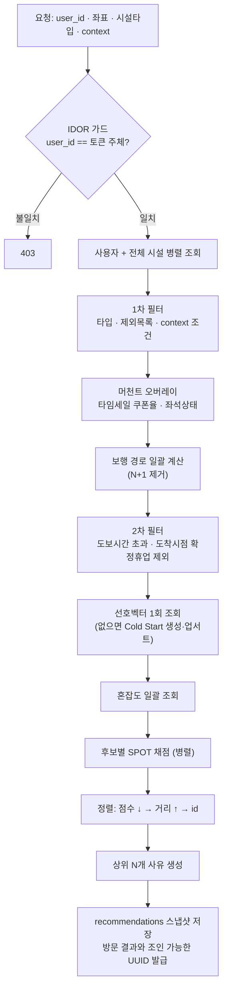

# NextSpot 시스템 맵 — 구조 · 기능 · 연결관계

> 작성 기준: 2026-08-20 코드 직접 조사(`8f84803`) → 2026-08-28 RBAC 반영 → 2026-09-04 저장소 정리 반영(경로·개수·인증 갱신)
>
> 이 문서는 **현재 코드에 실제로 구현된 것**만 기술한다. `README.md`와
> `docs/archive/ARCHITECTURE_OVERVIEW.md`는 각각 공모전 서사·상속 베이스 문서라 최신 상태와
> 어긋나는 부분이 있다(§14 참조). 구조를 파악할 때는 이 문서를 우선한다.

---

## 1. 제품 한눈에

경주 황리단길의 **오버투어리즘을 실시간으로 분산**시키는 대안 장소 추천 서비스.
사용자가 가려는 곳이 붐빌 때, **"당신이 도착할 시점"의 혼잡을 예측**해 한산한 대안을 추천한다.

핵심 산식은 **SPOT Score** 하나로 수렴한다.

```
SPOT = 0.40 · 취향일치  −  0.40 · 시간비용  +  0.20 · 인센티브
```

이 한 줄이 제품 전체의 축이다. 나머지 기능은 대부분 이 산식의
**입력을 개선하거나**(수집·예측·신뢰도), **출력을 설명하거나**(사유·비교·임팩트),
**출력에 개입하는**(쿠폰·타임세일) 역할이다.

세 종류의 사용자가 하나의 데이터 루프를 공유한다.

| 사용자 | 진입점 | 하는 일 |
|---|---|---|
| **관광객** | `/main` | 혼잡 확인 → 대안 추천 수락 → 방문 → 체감 혼잡 제보 |
| **소상공인(사장님)** | `/merchant` | 내 가게 성적표 확인 → 타임세일·좌석상태 방송 |
| **지자체/관제(B2G)** | `/admin` | 혼잡 관제 → 쿠폰 정책 개입 → 분산 효과 측정 |

관광객의 제보가 혼잡 데이터가 되고, 그 데이터가 예측 모델을 학습시키고,
모델이 추천을 만들고, 관제가 쿠폰으로 추천에 개입하고, 그 결과가 다시 임팩트로 측정된다.

---

## 2. 저장소 구조

모노레포(npm workspaces). 배포 단위는 **웹(정적) / API(컨테이너) / DB(Supabase)** 3개.

```
NextSpot/
├── apps/
│   ├── web/                    # Next.js 16 · React 19 · 정적 export → Vercel
│   │   ├── app/                # App Router — 33개 라우트 (§5)
│   │   │   ├── (관광객)         main · explore/{map,recommend} · course · waiting
│   │   │   │                    saved · setup · mypage/* · login · auth/callback
│   │   │   ├── admin/*         # B2G 관제 10화면
│   │   │   ├── merchant/*      # 사장님 콘솔 2화면 (API·로컬 상태는 lib/merchant/)
│   │   │   └── dev             # 개발자 콘솔 — 역할 임명 · 사업자 심사 · 최근 실패
│   │   ├── components/         # 공용 + main/(메인 화면 전용) · shell/(앱 셸·PWA) · admin/(관제)
│   │   ├── lib/                # API 클라이언트 · 인증 · 지역팩 · 로컬 상태 + voice/ · map/ · merchant/
│   │   │   └── i18n/           # ko · en · ja · zh 4개 로케일
│   │   ├── types/              # 앰비언트 타입 선언 (Web Speech · Kakao Maps — 런타임 코드 없음)
│   │   ├── e2e/                # Playwright — 여정루프 · 음성 · 다국어
│   │   └── public/             # PWA 매니페스트 · 서비스워커 · 마스코트
│   │
│   └── api/                    # FastAPI · Python 3.11 → Render
│       ├── app/
│       │   ├── main.py         # 라우터 23개 등록 + 부팅 워밍업 4단계 (§3.2)
│       │   ├── core/           # config(env) · authz(역할·소유권) · supabase(JWT·클라이언트) · logging · failure_log · vector
│       │   ├── routers/        # 23개 — HTTP 경계 (§5 표)
│       │   └── services/       # 도메인 로직 (평면 34개 + 하위 패키지 3)
│       │       ├── spot/       # ★ SPOT 산식 런타임 정본 (score·preference·travel·wait_time)
│       │       ├── tourapi/    # 한국관광공사 OpenAPI 클라이언트·변환·인사이트
│       │       └── batch/      # 적재 스크립트 전용 (localdata · wikimedia · kakao_coordinate · tourism_demand_evaluation)
│       ├── scripts/            # 12개 배치 — 적재 · 학습 · 품질평가 · 번역 · 태깅 · 보행 그래프
│       └── tests/              # pytest — routers · services · core · scripts · migrations
│
├── packages/shared-types/      # ★ SPOT 상수 단일 정의점 (web ↔ api, CI 패리티 강제)
├── supabase/
│   ├── migrations/             # 스키마 정본 (타임스탬프 순)
│   └── RESET_AND_SETUP.sql     # scripts/build_reset.mjs 가 마이그레이션에서 자동 생성
├── scripts/                    # build_reset.mjs · check-i18n-keys.mjs · check-docs.mjs · run-web-tests.mjs
├── .github/workflows/          # ci · ingest · train-recommendation-model · collect-area-demand · uptime
└── docs/                       # 운영 문서 · contest/ · archive/ (색인 docs/README.md)
```

**단일 정의점 3곳** — 여기를 바꾸면 여러 곳이 동시에 움직인다.

| 파일 | 무엇의 단일 소스 | 강제 장치 |
|---|---|---|
| `apps/api/app/services/spot/score.py` | SPOT 가중치·산식 | `packages/shared-types/spot.ts`와 CI 패리티 테스트 |
| `apps/web/lib/region.ts` | 서비스 지역(중심좌표·지오펜스·프리셋) | 다지역 확장 시 이 파일 + `.env` 좌표만 교체 |
| `supabase/migrations/` | DB 스키마 | CI `schema` 잡이 RESET_AND_SETUP.sql 일치 검증 |

---

## 3. 런타임 아키텍처

### 3.1 전체 흐름



### 3.2 부팅 워밍업 (`main.py` lifespan)

Render 무료 티어(0.1 CPU)의 콜드 비용을 첫 사용자에게 전가하지 않기 위해,
`/health`가 준비 완료를 알리기 전에 4가지를 미리 채운다. **전부 best-effort** —
실패해도 서버는 기존 lazy 경로로 정상 기동한다.

| 순서 | 워밍업 | 해결하는 문제 |
|---|---|---|
| 1 | 모델 매니저 기동 (`start_model_manager`) | Storage 모델 아티팩트 최초 다운로드·언피클 비용(로컬 866ms → 0.1 CPU에서 10배) |
| 2 | JWKS 공개키 프리페치 | 첫 인증 요청의 DNS+TLS 신규 왕복(실측 772ms) |
| 3 | 시설 캐시 프리필 (`fetch_all_facilities`) | 첫 `by-type`의 캐시 미스(실측 최악 13초) |
| 4 | 지역 근거 병렬 준비 — 주차·날씨·축제(전체 12초 상한) | 첫 추천에서 지역 수요가 빠지거나 콜드 호출로 늦어지는 것 |

> 배경: 2026-07-16 프로덕션에서 첫 `/recommendations/by-type`이 **18.8초** 걸려
> 프런트 10초 타임아웃을 넘겼다. 콜드 스타트가 아니라 위 1~3의 합이었다(4는 2026-08-20 추가).

종료 시엔 LLM AsyncClient와 모델 폴링 태스크를 정리한다.

### 3.3 성능·안정성 장치

- **시설 캐시** — 단일 키(`'all'`) TTL 캐시. 모든 사용자·모든 위치가 한 번의 프리필을 공유
- **N+1 제거** — 혼잡도(`fetch_congestion_map`)·보행 경로(`get_walking_routes`)를 후보 전체 일괄 조회
- **워커 스레드 오프로드** — 동기 sklearn 추론을 `asyncio.to_thread`로 이벤트 루프 밖에서
- **stale connection 재시도** — `_StaleConnectionRetryTransport`가 keepalive 만료 500을 1회 재시도
- **프런트 타임아웃** — Supabase 6초 / API 10초. 초과 시 무한 로딩 대신 폴백 UI

---

## 4. 역할 기반 접근 제어(RBAC) — 누가 무엇을 할 수 있나

세 앱이 **하나의 인증**을 쓴다. Supabase JWT 로 사용자를 특정하고, `public.users.role` 이
무엇을 할 수 있는지 정한다. 가드는 `apps/api/app/core/authz.py` 하나다.

| 역할 | 들어갈 수 있는 곳 | 판정 |
|---|---|---|
| `tourist` | 관광객 앱 | 기본값. 익명(게스트) 세션도 여기 속한다 |
| `merchant` | `/merchant` 사장님 콘솔 | `require_role("merchant")` |
| `admin` | `/admin` 관제 대시보드 | `require_role("admin")` — 사장님 콘솔에는 못 들어간다 |
| `developer` | 전부 + `/dev` | 모든 `assert_role` 을 통과한다 |

**역할과 소유권은 다른 축이다.** `merchant` 는 "콘솔에 들어갈 수 있다"만 뜻하고,
**어느 가게를 다루는가**는 `facility_owners` 가 정한다(`require_facility_owner`).
이게 없으면 아무나 남의 가게 좌석 상태를 방송할 수 있고, 그 방송은 `evidence_tier='verified'`
로 학습 데이터에 들어간다(CONGESTION_TRUST_SPEC).

**역할 판정은 DB 조회 + 30초 캐시**다. JWT 커스텀 클레임을 쓰지 않는 이유는 토큰 갱신(최대
1시간)까지 구 역할이 남아 **권한 회수가 늦어지기** 때문이다. 임명·회수 API 가 해당 사용자
캐시를 즉시 무효화한다.

### 예외 하나 — 세션이 없는 기계 호출자

스케줄러(Supabase pg_cron, GitHub Actions)는 Supabase 세션을 가질 수 없다. 이들만
`X-Service-Token`(구 `X-Admin-Authorization` 도 수용) 공유 토큰을 쓰며,
`require_machine_or_role` 을 건 **수집 트리거 한 경로**에서만 유효하다.

| | 폐지된 구 방식 | 지금의 서비스 토큰 |
|---|---|---|
| 토큰 위치 | `NEXT_PUBLIC_*` — 정적 번들에 노출 | 서버 env / Vault / Actions Secret 전용 |
| 통하는 범위 | 관리자 API 전체 | `/api/v1/area-demand/snapshots/collect` 하나 |
| 사용자 특정 | 불가(소유권 검사 불가) | 불필요(사람이 아님) |

> 폐지 이력: 사장님 `X-Merchant-Token` 은 `LEGACY_CONSOLE_TOKENS=false` 로 꺼져 있고,
> 관리자 비밀번호(`NEXT_PUBLIC_ADMIN_PASSWORD`)와 프런트 미러 토큰은 제거됐다.

**관광객 세션 생애주기** — 마찰 없는 진입이 설계 목표다.

```
SessionBootstrap: 익명 세션 자동 발급
        │
        ├─ linkOAuth   → 같은 auth.users 행에 소셜 identity 승격
        │                 (user_id 불변 = 데이터 그대로 승계)
        │                 진입점: 마이페이지 AccountSection('내 계정 만들기' 의도)
        └─ signInOAuth → 소셜 계정으로 로그인(계정 전환). 처음이면 새 계정 생성
                          진입점: /login 의 'SNS 계속하기'('로그인' 의도)
                          → POST /api/v1/account/merge-guest 로 게스트 데이터 소유증명 승계
                          → lib/userData.ts 가 이전 사용자 개인 데이터만 allowlist 로 삭제
                             (언어·지도뷰·PWA 스누즈 같은 '기기 설정'은 보존)
```

> **진입점마다 다른 함수를 쓰는 이유**(2026-08-27): `/login` 에서 `linkOAuth` 를 쓰면, 이미 그
> 소셜 계정으로 가입한 사용자는 `identity_already_exists` → 콜백 자동 폴백 → **프로바이더 2회 왕복**이
> 된다(계정 선택 화면이 두 번 뜬다). 재방문자는 전부 이 경로다. 로그인 의도인 `/login` 은 처음부터
> `signInOAuth` 로 1회에 끝내고, 게스트 승격 의도인 마이페이지만 `linkOAuth`(uid 불변)를 쓴다.

> **소셜 프로바이더 상태**: 구글 정상. **카카오는 KOE205 로 막혀 있다** — Supabase Auth 가
> `account_email` scope 를 서버에 하드코딩해 항상 요청하는데(대시보드에 Kakao Scopes 칸이 없고,
> 코드의 `options.scopes` 는 대체가 아니라 **덧붙기**다), 그 동의항목은 카카오 비즈 앱 전용이다.
> 업스트림 이슈 supabase/supabase#36878 미해결. **카카오 '개인 개발자 비즈 앱 전환'** 이 선행되어야
> 한다. 코드는 프로바이더 무관하게 준비돼 있어 승인 후 별도 수정이 필요 없다.

**보안 원칙 (코드에 강제되어 있음)**

- `ADMIN_API_TOKEN`·`JWT_SECRET`은 기본값 없는 필수 env — 비어 있으면 **부팅 실패**
  (빈 토큰이면 `Bearer ` 만으로 서비스 토큰 가드가 뚫린다)
- 서비스 토큰은 **절대 `NEXT_PUBLIC_` 으로 미러하지 않는다** — 그 순간 다시 공개된다
- 브라우저 번들에 `service_role` 키를 절대 두지 않음 — 관리 작업은 반드시 백엔드 경유
- CORS: `ALLOWED_ORIGINS`가 명시 목록이면 엄격 모드(credentials 켬),
  `*`면 credentials 끔 (와일드카드 + credentials는 CORS 표준 위반)
- IDOR 가드: 본문 `user_id`가 토큰 주체와 다르면 403

---

## 5. 기능 카탈로그 — 화면 ↔ API ↔ 서비스

### 5.1 관광객 앱

| 화면 | 기능 | 호출 API | 핵심 서비스/모듈 |
|---|---|---|---|
| `/` | 랜딩 | — | — |
| `/setup` | 온보딩 Cold Start (카테고리·도보시간·체류시간·속성) | `POST /preferences/parse` | `preference_nlp_service` |
| `/main` | 홈 — 혼잡 지도·날씨·축제·화장실·진행중 여정 | `GET /infrastructures` `/weather` `/events` `/restrooms` `/freshness` | `facility_cache` `weather_service` `restroom_service` |
| `/explore/map` | 혼잡도 지도 + 시간대별 AI 예측 모드 | `POST /predict/batch` `GET /predict/day` `/predict/golden-hour` | `predict_service` |
| `/explore/recommend` | **대안 추천 (핵심)** | `POST /recommendations` `/recommendations/by-type` | **SPOT 엔진** |
| ″ | 추천 사유 생성 | `POST /recommendations/{id}/explain` | `reason_service` `recommendation_explanation_service` |
| ″ | 수락 / 거절 피드백 | `POST /recommendations/accept` `/reject` `/feedback` | `feedback_service` `preference_vector_service` |
| ″ | 음성 비서 | `POST /voice/turn` | `voice_intent_service` + `lib/voice/voiceCommands.ts` |
| ″ | 자연어 현장조건 | `POST /travel-context/parse` | `travel_context_parser` |
| `/course` | 멀티스톱 분산 코스 | `POST /courses/recommend` | 누적 도착시각 기반 SPOT 반복 |
| `/waiting` | 대기 현황 보드 | `GET /infrastructures` | `facility_cache` |
| `/saved` | 저장한 장소 | (로컬) | `lib/savedFacilities.ts` |
| `/mypage` | 취향 레이더 | `GET /users/me/vector` | `preference_vector_service` |
| `/mypage/coupons` | 내 쿠폰함 | `GET /coupons/mine` · `POST /coupons/{id}/use` | `coupon_service` |
| `/mypage/impact` | 내 여행 임팩트 | `GET /impact/summary` | 수락·혼잡회피·쿠폰 성과 집계 |
| `/mypage/lab` | **거절 실험실** | `GET /lab/pending` · `POST /lab/{id}/reason` | `lab` 라우터 + LLM 분류 |
| 전역 | 혼잡 제보 | `POST /reports/congestion` | `congestion_evidence` |
| 전역 | 방문 결과 기록 | `PATCH /recommendations/{id}/outcome` | `recommendationOutcomes.ts` (오프라인 큐) |
| 전역 | 사용성 트래킹 | `POST /events/track` | `tracking` (무인증, IP 쿨다운) |
| 전역 | 키워드 검색 | `GET /search/keyword` · `POST /search/ingest-request` | `search_rewrite_service` |

**거절 실험실**(`/mypage/lab`)은 이 제품 특유의 기능이다 — 거절한 추천의 사유를
나중에 되묻고, **답한 만큼만 1회** 취향 벡터에 반영한다. 무응답 거절이 선호를
잘못 학습시키는 것을 막는 장치다.

#### 5.1.1 홈 상단 칩 — 두 의미 그룹의 색 체계

`/main` 검색창 오른쪽 칩들은 **역할이 다른 두 묶음**이 세로로 쌓인 구조다. 둘을 색으로
가른다(2026-08-27). 지도 위에 떠 있는 반투명 칩이라 테두리만으로는 구분이 안 되므로,
**꺼져 있을 때도 보이는 요소**(카테고리 아이콘 / 토글 앞의 점)에 그룹 색을 얹는다.

| 그룹 | 행 | 의미 | 색 | 항상 보이는 신호 |
|---|---|---|---|---|
| A | 카테고리 칩 (`filters`) | **무엇을 찾을지** | 금(`gold`) | 아이콘 `text-gold/55`, 왼쪽 `border-gold/70` 띠 |
| A | 음식분류 칩 (`cuisineChips`, `음식점`일 때만) | 위 행의 하위 분류 — 의미를 공유 | 금(한 단계 옅게) | 테두리 `border-gold/25`, 같은 금색 띠 |
| B | 레이어·조건 토글 (히트맵·배리어프리·주차·반려동물) | **추가 조건 적용** | 청록(`jade`) | 앞의 점 `bg-jade/45`, 왼쪽 `border-jade/70` 띠 |

- 히트맵 칩은 이전에 홀로 주칠(`terracotta`)이었다 — 같은 줄에서 혼자 튀어 그룹이 깨졌다.
  칩 색은 B 그룹(청록)을 따르고, '혼잡'이라는 의미는 🔥 이모지와 **켜졌을 때의 주칠 맥동 점**이
  계속 전달한다.
- 모바일 도구 시트(`showMobileTools`)의 같은 버튼들도 동일한 색을 쓴다 — 어긋나면 그룹 학습이 깨진다.
- **`/waiting` 진입 칩은 이 줄에서 제거했다**(2026-08-27). 토글이 아니라 화면을 아예 떠나는
  내비게이션이라 '조건 적용' 그룹의 의미와 맞지 않았다. `/waiting` 은 하단 탭바로 그대로 간다
  (진입 경로가 탭바 하나로 단일화됨 — 데스크톱 칩·모바일 시트 양쪽에서 삭제).

### 5.2 사장님 콘솔 (`/merchant`)

| 기능 | API | 설명 |
|---|---|---|
| 내 가게 성적표 | `GET /merchant/stats` | 노출·수락·방문 수치 |
| AI 브리핑 | `GET /merchant/briefing` | `merchant_briefing_service` (LLM) |
| 셀프 타임세일 | `POST /merchant/timesale` · `/timesale/cancel` | 쿠폰율 즉시 상향 → **SPOT w₃에 직결** |
| 좌석상태 방송 | `POST /merchant/seat-status` | 30분 신선도 내 **실측으로 취급** (`verified` 등급) |

진입 경로는 `/mypage`(비즈니스 계정으로 전환) · `/mypage/settings` · `/merchant/dashboard`(가게 변경)
세 곳이다. 게이트(`/merchant`)는 전체화면이라 그동안 **어느 단계에서도 되돌아갈 수단이 없었다** —
비밀번호를 모르면 브라우저 뒤로가기 외에는 갇혔다. 2026-08-27 에 상단 좌측 `← 나가기` 를 추가했고,
세 상태(비밀번호 게이트 · 최근 가게 · 가게 선택) 모두에서 노출된다. 동작은 이력이 있으면
`router.back()`, 새 탭에서 직접 연 경우처럼 돌아갈 이력이 없으면 `/mypage` 로 보낸다.

### 5.3 B2G 관제 (`/admin`)

| 화면 | API | 설명 |
|---|---|---|
| `/admin/dashboard` | `GET /admin/dashboard/today` `/dashboard/briefing` `/metrics` `/metrics/trend` | 지표·추세·AI 브리핑 |
| ″ | `GET /admin/model-trust` | **모델 신뢰 패널** (§7.2) |
| `/admin/infrastructure` | `POST/PATCH/DELETE /admin/facilities` · `POST /admin/facilities/{id}/congestion` | 시설 CRUD·혼잡 수동 입력 |
| `/admin/simulator` | `POST /admin/simulate-peak` | 피크 시뮬레이션 + SPOT 시뮬레이터 |
| ″ | (쿠폰 정책 패널) `PUT /admin/settings` | **POI별 할인율 조정 → 추천 순위 즉시 반영** |
| `/admin/safety` | `GET /admin/safety/status` | 인파 안전 조기경보 |
| `/admin/report` | `GET /admin/impact` | 분산 효과 정량화 |
| `/admin/support` | `GET/PATCH /admin/inquiries` | 문의 처리 |
| `/admin/reports` | `GET /search/ingest-requests` · `POST .../approve` | **검색 0건 → 승인형 배치 적재** |

관제의 폐루프는 **관제 → 개입(쿠폰) → 효과 측정**으로 닫힌다.
쿠폰 정책 패널에서 할인율을 올리면 `coupon_rate`가 SPOT 인센티브 항에 즉시 반영되고,
그 결과가 `/admin/report`의 "절감 대기시간 · 재배치 건수"로 되돌아온다.

---

## 6. 추천 파이프라인 — `POST /recommendations/by-type`

핵심 엔드포인트의 실제 흐름. 순서에 의미가 있다.



### SPOT 채점 내부 (`spot/score.py`)

```
1. 취향 일치      preference.py — 8차원 코사인 (barrier_free는 features로 브리지)
2. 이동 시간      travel.py — Kakao Directions(키 있으면) 또는 Haversine 도보환산
3. 도착시점 혼잡  ★ arrival = 출발시각 + 이동시간   ← 이 제품의 정체성
                  ├ 신선한 실측 있음 → measured (그대로 사용)
                  └ 없음             → sklearn 예측
                     ├ + TourAPI 집중률 25% prior (이름 정확매칭 후보만)
                     └ + 축제 혼잡 보정 (거리감쇠 가중, cat2=A0207 축제만)
4. 대기 시간      wait_time.py — 도착시점 혼잡 → 대기 분 (피크판정은 KST)
5. 인센티브       0.5·min(1, coupon_rate/20%) + 0.5·max(0, 원본혼잡 − 도착시점혼잡)
6. 종합·정규화    (0.4·pref − 0.4·time + 0.2·incent + 0.4) / 1.2  →  [0,1]
```

**시각 규약** — 모델 입력 `hour`는 **UTC**(학습 계약), 영업 피크 판정은 **KST**.
호스트 타임존이 흔들려도 결과가 변하지 않도록 명시적으로 처리한다.

**`scoring_mode` 3종** — 응답에 실려 프런트 라벨을 결정한다.

| 모드 | 조건 | 사용자에게 보이는 것 |
|---|---|---|
| `measured_rules` | 신선·신뢰 실측 존재 | 혼잡 회피는 순위에 반영, **대기 숫자는 비노출** |
| `model` | 검증된 모델 추론 | 'AI 예측' 라벨 + 대기시간 |
| `degraded_rules` | 검증된 모델 없음 | 혼잡·대기 **완전 제외**, 이동시간만 |

> **정직한 데이터 표시 원칙** — 정성 실측을 인원수로 합성하지 않고,
> 로그 없는 시설을 `0.0` 실측처럼 팔지 않으며, 예측값에는 반드시 'AI 예측' 라벨을 단다.
> 응답의 `breakdown`이 점수 분해를 전부 노출해 추천 사유가 검증 가능하다.

---

## 7. 신뢰 폐루프 — 이 프로젝트에서 가장 정교한 부분

"합성 데이터로 만든 모델이 실측인 척하지 않게" 하기 위한 2단 게이트.

### 7.1 혼잡 근거 등급 (`congestion_evidence.py`)

```
single_report   → 지도 표시 O, 순위 반영 X
corroborated    → 순위 반영 O  ┐ 단, 30분 이내(RANKING_FRESHNESS)일 때만
verified        → 순위 반영 O  ┘
seed/simulated  → 공개 조회에서 아예 제외 (개발 이력으로만 보존)
```

`latest_congestion_for_facilities` RPC가 **DB 레벨에서** 이 필터를 강제한다.
애플리케이션 버그가 나도 seed 데이터가 '지금 혼잡'으로 새어 나갈 수 없다.

**수집 경로 3개** — 마이그레이션 `20260820123000`이 연결했다.

| 출처 | 등급 | 경로 |
|---|---|---|
| 사용자 혼잡 제보 | `single_report` → 교차검증 시 `corroborated` | `POST /reports/congestion` → `correlate_congestion_report_evidence` |
| 방문 후 체감 혼잡 | 투영 | `recommendation_outcomes` → `project_outcome_congestion_log` |
| 사장님 좌석 방송 | `merchant_report` / `verified` | `POST /merchant/seat-status` |

### 7.2 모델 승격 게이트 (`predict_service.py`)

저장소의 `model.pkl`은 합성 데모 모델이라 **운영 추론에 쓰지 않는다.**
비공개 Storage(`recommendation-models` 버킷, `public=false`)의 아티팩트가
`model_registry.status='active'`이고 아래를 **전부** 통과해야 메모리에 올라간다.

```
sha256 형식 검증 · feature_schema_version == "congestion-v1:type-hour-dow"
real_data_count      ≥ 300        holdout_n              ≥ 60
MAE                  ≤ 0.15       baseline_improvement   ≥ 20%
타입별 관측수        ≥ 50 (활성 타입 전부)
source_composition 에 synthetic/seed/simulated/single_report 가
                   하나라도 포함되면 → 거부
```

- 활성 모델은 **항상 하나** — 부분 유니크 인덱스 + `promote_recommendation_model` 단일 트랜잭션
- **5분 폴링**으로 새 버전 감지. 검증 실패 시 **기존 정상 스냅샷 유지**
- 검증된 모델이 없으면 → `degraded_rules`로 정상 기동 (서비스는 절대 죽지 않는다)
- 학습은 매주 월요일 03:00 KST GitHub Actions (`train-recommendation-model.yml`)

---

## 8. LLM 보조 레이어 — 항상 '보조'

`services/llm_client.py` — 제공자 독립 OpenAI 호환 어댑터. 기본 **Upstage Solar (`solar-pro3`)**.

**설계 원칙: 무해 폴백.** 전신 InduSpot에서 Vertex Gemini를 제거했던 이유(외부 의존·데모 리스크)를
코드 주석이 명시적으로 기억하고 있다 — *"LLM은 항상 보조다. 주 경로를 LLM으로 바꾸는 변경은
이 원칙 재검토 후에만."*

```
UPSTAGE_API_KEY 미설정 → is_enabled() False → 네트워크 없이 즉시 None
타임아웃(3초) / HTTP 오류 / JSON 파싱 실패 → 전부 None
                    ↓
   호출자는 기존 결정적 경로(키워드 분류기·템플릿)를 그대로 사용
   ⇒ LLM 장애가 기능 장애로 승격되지 않는다
```

**소비 지점 9곳** — 모두 결정적 폴백을 가진다.

| 모듈 | LLM 역할 | 폴백 |
|---|---|---|
| `reason_service` | 추천 사유 문체 다듬기 | 결정적 한국어 템플릿 |
| `voice_intent_service` | 음성 의도 분류 | 키워드 분류기 |
| `preference_nlp_service` | 자연어 취향 파싱 | 한국어 키워드 규칙 |
| `travel_context_parser` | 현장 조건 파싱 | allowlist 규칙 |
| `search_rewrite_service` | 검색 0건 질의 재작성 | 빈 결과 |
| `recommendation_explanation_service` | 상세 설명 | 템플릿 |
| `briefing_service` / `merchant_briefing_service` | 관제·사장님 브리핑 | 수치 요약 |
| `festival_summary_service` | 축제 요약 | 원문 |
| `lab` 라우터 | 거절 사유 분류 | 사용자 선택 |

비용 방어: 무인증 검색 경로에는 **IP 분당 리밋 + 전역 일일 예산 캡**
(`SEARCH_REWRITE_DAILY_BUDGET`, 기본 200회, KST 리셋) 2중 장치.

---

## 9. 외부 데이터 연동

| 소스 | 용도 | 키 없을 때 |
|---|---|---|
| **TourAPI** (한국관광공사) | POI 적재·상세·무장애·축제 조회 | 호출 시점에 한국어 오류 (부팅은 정상) |
| **기상청 단기예보** | 시간대별 날씨 칩 | `unavailable` 폴백 |
| **Kakao Local** | 좌표 검색·화장실·POI 보강 | 해당 기능 비활성 |
| **Kakao Directions** | 실경로 도보 시간 | **Haversine 직선거리 도보 환산** |
| **Kakao Maps SDK** | 프런트 지도 | — |
| **LOCALDATA** (행안부) | 인허가 기반 영업상태 검증 | 배치 미실행 |
| **Wikimedia** | 이미지 보강 | 기본 이미지 |
| **Upstage Solar** | LLM 보조 | 결정적 경로 (§8) |

**모든 외부 연동이 무해 폴백을 가진다** — 키 하나가 빠져도 서비스 전체는 계속 동작한다.
이것이 이 코드베이스에서 가장 일관되게 지켜지는 규칙이다.

---

## 10. 데이터 모델 (24 테이블 중 주요 표)

```
facilities ──┬── congestion_logs ────── (evidence_tier · source)
             ├── facility_source_refs   (TourAPI/LOCALDATA/Kakao 출처 추적)
             ├── merchant_timesales     (사장님 쿠폰율 상향)
             ├── saved_facilities
             └── recommendations ─── recommendation_outcomes ──┐
                                                               │ project_outcome_
                                                               │ congestion_log
                                          congestion_logs ◀────┘  (역류)

users ──┬── user_preference_vectors   (8차원, 수락 +10% / 거절 −5%)
        ├── user_feedback             (거절 실험실 원천)
        ├── user_coupons
        └── inquiries

model_registry ──── Storage: recommendation-models (private)
tourism_concentration_forecasts · tourism_insight_snapshots   (TourAPI 데이터랩)
admin_ingest_requests   (검색 0건 → 승인형 적재)
app_events              (경량 제품 분석)
system_settings
```

**주요 DB 함수** — 비즈니스 규칙 일부가 의도적으로 DB에 있다.

| 함수 | 역할 |
|---|---|
| `latest_congestion_for_facilities` | 신뢰 등급·출처 필터를 **DB에서 강제** |
| `promote_recommendation_model` | 모델 활성화 (service_role 전용, 단일 트랜잭션) |
| `record_recommendation_outcome` / `project_outcome_congestion_log` | 방문 결과 → 혼잡 로그 투영 |
| `correlate_congestion_report_evidence` | 제보 교차검증 → 등급 승격 |
| `apply_localdata_sync` | 인허가 데이터 동기화 (임시휴업 보존) |
| `handle_new_user` / `get_auth_user_role` | 가입 트리거 · RLS 역할 판정 |

---

## 11. 배치 자동화

| 워크플로 | 주기 | 하는 일 |
|---|---|---|
| `ci.yml` | push / PR | web(lint→typecheck→test→build) · api(ruff→pytest) · schema · e2e(Chromium 390px, 4로케일) |
| `ingest.yml` | 매일 04:00 KST | TourAPI POI 적재 (contentid upsert) |
| `train-recommendation-model.yml` | 매주 월 03:00 KST | 모델 학습 → 게이트 검증 → 승격 |
| `collect-area-demand.yml` | 수동 | 주차 실측 수집 수동 복구(정기 수집은 Supabase pg_cron 10분 주기) |
| `uptime.yml` | 수동 | 헬스체크(장애 진단용) |

**수동 스크립트** (`apps/api/scripts/`)

`ingest_tourapi.py` · `ingest_localdata.py` · `ingest_kakao_places.py` · `ingest_tourism_insights.py`
`train.py --dry-run` (후보 평가만, 등록 없음) · `recommendation_quality.py`
`reconcile_kakao_coordinates.py` · `tag_cuisines.py` · `translate_overviews.py`

---

## 12. 로컬 실행

```powershell
.\run_local.ps1     # 백엔드 8000 + 프론트 3000 동시
```

```bash
uvicorn app.main:app --reload --port 8000   # apps/api — 문서 /docs
npm run dev --prefix apps/web               # apps/web — :3000
cd apps/api && python -m pytest -q          # API 테스트 (Python 3.11 · PYTHONUTF8=1)
npm run test --workspace=apps/web           # i18n 키 검사 + lib/**/*.test.ts 전부
npm run test:e2e --workspace=apps/web       # Playwright (npx playwright install 선행)
```

**필수 env** — `SUPABASE_URL` `SUPABASE_ANON_KEY` `JWT_SECRET` `ADMIN_API_TOKEN` (없으면 부팅 실패)
+ `SUPABASE_SERVICE_ROLE_KEY` (쓰기 경로에 필요)

**선택 env** — `KAKAO_REST_API_KEY` `TOURAPI_KEY` `KMA_API_KEY` `UPSTAGE_API_KEY`
`SERVICE_API_TOKEN`(스케줄러 토큰 회전용 — 없으면 `ADMIN_API_TOKEN` 폴백)

**콘솔에는 맞출 토큰이 없다.** 사장님·관리자 콘솔은 앱 계정 로그인 + `users.role` 로 들어간다
(§4). 프런트에 미러할 값이 없으므로 "한쪽만 바꿔서 401" 이라는 실패 모드 자체가 사라졌다.
남은 짝맞춤은 스케줄러 하나뿐이다:

| 호출자 | 백엔드 env | 호출자 쪽 설정 |
|---|---|---|
| Supabase pg_cron | `SERVICE_API_TOKEN`(없으면 `ADMIN_API_TOKEN`) | Vault `nextspot_area_demand_admin_token` |
| GitHub Actions | 〃 | Actions Secret `SERVICE_API_TOKEN`(없으면 `ADMIN_API_TOKEN`) |

---

## 13. 확장 포인트

| 확장 | 건드릴 곳 |
|---|---|
| **다른 지역** | `apps/web/lib/region.ts` + `ingest_tourapi.py --lat --lng` 재실행 |
| **다른 LLM 제공자** | `LLM_BASE_URL` / `LLM_MODEL` env만 (OpenAI 호환이면 무엇이든) |
| **SPOT 가중치 조정** | `score.py` **와** `shared-types/spot.ts` 동시 (한쪽만 바꾸면 CI 실패) |
| **새 데이터 소스** | `services/`에 무해 폴백 갖춘 모듈 + `facility_source_refs`로 출처 추적 |
| **새 언어** | `lib/i18n/messages/*.json` (parity 테스트가 키 누락 차단) |
| **지도·음성 SDK 새 API** | `apps/web/types/*.d.ts` 에 쓰는 표면만 추가 (전체 미러 금지 — 안 쓰던 멤버를 부르면 tsc 가 잡는다) |

---

## 14. 기존 문서와의 정합성 메모

조사 중 발견한, **문서가 코드보다 뒤처진 지점**들이다.

1. **`docs/archive/ARCHITECTURE_OVERVIEW.md` §4는 "외부 LLM 없이 내장 폴백"이라고 단언하지만 현재는 틀리다.**
   `llm_client.py`가 Upstage Solar를 연동했고 9개 서비스가 소비한다. 다만 문서의 *정신*
   (LLM은 보조, 무해 폴백)은 코드에 정확히 살아 있다.

2. **같은 문서 §3의 폴백 체인 "로컬 model.pkl → 0.5"는 낡았다.**
   현재는 Storage 레지스트리 + 품질 게이트 + `degraded_rules`
   (0.5 상수 대신 **혼잡 항 자체를 산식에서 제외**)로 대체됐다.

3. **`revert/ui-editorial-pass`(PR #5)로 되돌려진 UI 작업이 복구되지 않았다.**
   랜딩·온보딩·추천카드·4개 로케일에 걸친 219줄과 `onboarding-usability.spec.ts`가
   main에서 빠져 있다. 작업물은 `origin/feature/ui-editorial-pass`에 남아 있다.

4. **`docs/archive/`의 문서는 기획·감사 시점 스냅샷**이다(2026-09-04 정리 — 색인은 `docs/README.md`).
   런타임 정본은 언제나 `score.py` / `predict_service.py` / `congestion_evidence.py` 세 파일이다.
