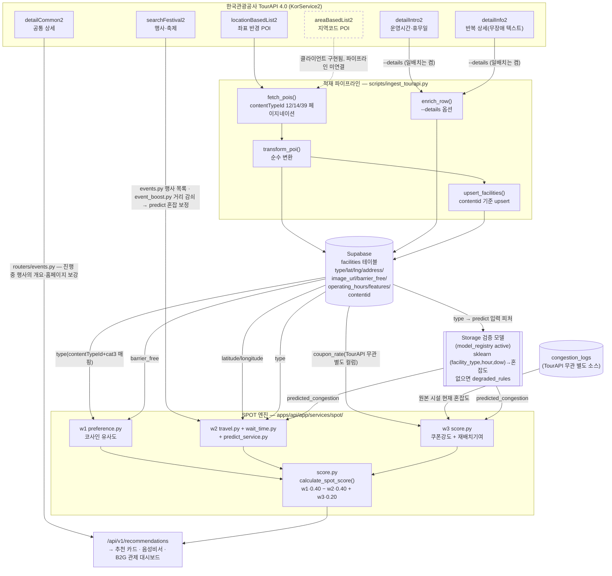

# 데이터 활용 명세 — TourAPI → SPOT 산식 변수 매핑

> 2026-07-09 작성. 목적: 2026 관광데이터 활용 공모전 서면심사 필수 항목
> **「한국관광공사 OpenAPI(TourAPI) 활용의 적절성」**을 심사위원이 코드 근거와 함께 즉시 확인하도록,
> "TourAPI를 쓴다"가 아니라 **TourAPI 각 필드가 SPOT 산식의 어느 변수에 어떻게 기여하는지**를
> 매핑한다. (관련 배점 대응 전략: `docs/contest/CONTEST_STRATEGY.md` §2-A, 액션 A6)
>
> **정직성 고지**: 이 문서의 모든 서술은 실제 코드(`apps/api/app/services/tourapi/`,
> `apps/api/app/services/spot/`, `packages/shared-types/spot.ts`)에 근거한다. 존재하지 않는
> 엔드포인트·기능·수치는 기재하지 않는다. §2에서 현재 실행 상태를 가감 없이 밝힌다.

---

## 1. 현재 구현 상태 (정직 고지)

| 구성 요소 | 상태 | 근거 |
|---|---|---|
| TourAPI 비동기 클라이언트 (`client.py`, KorService2, 9개 엔드포인트 함수) | ✅ 구현 완료 | `apps/api/app/services/tourapi/client.py` |
| 응답→적재 행 변환 (`transform.py`, 순수 함수) | ✅ 구현 완료 + 단위테스트 | `apps/api/tests/services/test_tourapi.py` |
| 적재 배치 스크립트 (`scripts/ingest_tourapi.py`) | ✅ 구현 완료, **운영 중** | GitHub Actions `ingest.yml`이 매일 KST 04:00 `--details --radius 3000`으로 실행(2026-07-10 첫 실적재, 07-17 상세 적재) |
| Supabase 스키마 확장 | ✅ 적용 완료 | `supabase/migrations/20260707130000_add_tourapi_fields.sql` (contentid·contenttypeid·address·barrier_free·image_url + 부분 유니크 인덱스) |
| SPOT 엔진(w1/w2/w3) — TourAPI 파생 필드 소비 경로 | ✅ 구현 완료 | `apps/api/app/services/spot/{score,preference,wait_time}.py` |
| **DB 내 실데이터** | ✅ **실적재분 있음** | `facilities` **활성 1,669곳(전체 1,688곳, 2026-09-20 실측)** — TourAPI `contentid` 보유 89곳(활성 86곳) + Kakao·LOCALDATA 보완분. 수기 시드는 2026-08-21 마이그레이션으로 비활성(`unverified_demo_seed`) — 유형별 내역은 `JUDGE_QA.md` Q5 |
| **TourAPI 외 공공데이터** — 경주 ITS 공영주차 · 서울 실시간 도시데이터 | ✅ 주차 수집 중 / ⏳ 서울 수집기 구현 완료·적용 대기 | **§7**. 주차는 10분 주기로 실적재 중(2026-09-20 13:03 KST 관측 확인, 누적 4,012 스냅샷). 서울은 수집기·검증 화면까지 구현됐고 프로덕션 테이블 적용이 남았다 |
| **경주 추정 모드**(혼잡 **추정치**) | ✅ 구현 완료 — 화면에 항상 '추정' 라벨 | **§8**. `apps/api/app/services/congestion_estimator_service.py`. 읽을 때 계산하고 `congestion_logs`에 적재하지 않으므로 모델 학습에도 들어가지 않는다 |

**요약**(2026-09-20 갱신): 클라이언트·변환·적재·스키마·SPOT 엔진 소비 경로가 전 구간 존재하고 단위테스트로
검증되어 있으며, `TOURAPI_KEY` 발급 후 2026-07-10부터 실제 적재가 매일 돌고 있다. 즉 **"TourAPI 데이터가 SPOT 점수에
어떻게 반영되는가"는 코드로 확정**되어 있고, **"실제로 몇 건이 반영되었는가"는 원격 DB 실측**(`JUDGE_QA.md` Q5, 2026-09-20)으로
답한다. 아래 §3~§5의 매핑은 그 경로를 기술한다. TourAPI 밖의 공공데이터(주차·서울 실시간 도시데이터)와, 그것으로 만드는
**추정치의 한계**는 §7·§8에 따로 적는다 — 추정을 실측처럼 말하지 않기 위해 절을 나눴다.
(이 절은 2026-07-09 작성 당시 "실행 전"이었고 2026-09-04, 2026-09-20에 현재 상태로 정정했다.)

---

## 2. 데이터 흐름 다이어그램



범례: 실선 = 코드로 연결되어 운영 중인 경로. 점선 = 클라이언트
함수는 구현되어 있으나 파이프라인 호출부가 아직 없는 경로(§5 참고).

---

## 3. TourAPI 엔드포인트 → SPOT 산식 변수 매핑 표

SPOT 종합 스코어: `score = w1·preference − w2·time_cost + w3·incentive` (Min-Max 정규화),
`w1=0.40 / w2=0.40 / w3=0.20` — `apps/api/app/services/spot/score.py` (`packages/shared-types/spot.ts`와
CI 패리티 테스트로 정합 강제).

| 엔드포인트 | TourAPI 제공 필드 | 적재 컬럼 / features | SPOT 산식 기여 경로 | 기여 변수 | 연결 상태 |
|---|---|---|---|---|---|
| **locationBasedList2** | `mapx`,`mapy`(경도/위도) | `facilities.latitude/longitude` | `spot/travel.py get_travel_time_and_distance()` → `travel_time_min` → `total_time = wait+travel` → `time_cost=min(1,total_time/60)` | **w2(시간)** | 연결됨(운영 중) |
| locationBasedList2 | 위 좌표(동일 필드) | 동일 컬럼 | `routers/recommendations.py` — 사용자 위치 기준 bbox(도보 상한×100m, 기본 1,000m)로 1차 후보 채택 후 경로 시간으로 최종 제한 | 필터(후보 생성) | 연결됨 |
| locationBasedList2 | `contenttypeid`(12/14/39) + `cat3` | `map_facility_type()` → `facilities.type`(restaurant/cafe/attraction/culture) | `spot/preference.py CATEGORY_VECTORS[type]` → 사용자 벡터와 코사인 유사도 | **w1(선호)** | 연결됨 |
| locationBasedList2 | 위 `type`(동일) | 동일 | `spot/wait_time.py DEFAULT_PROCESSING_TIMES[type]` → 기본 처리시간 × 혼잡도 × 시간대 보정 = `predicted_wait` | **w2(시간)** | 연결됨 |
| locationBasedList2 | 위 `type`(동일) | 동일 | `predict_service.py predict_congestion(type, hour, dow)` 3피처 중 1(Supabase Storage의 검증된 active sklearn 모델) → `predicted_congestion` | **w2**(대기시간 산정 입력) 및 **w3**(재배치기여 성분) | 연결됨(활성 모델이 없으면 `degraded_rules` — 혼잡 항을 산식에서 제외, 임의 0.5 없음) |
| locationBasedList2 | `title` | `facilities.name` | 추천 카드·목록 표시명 | 표시 | 연결됨 |
| locationBasedList2 | `contentid` | `facilities.contentid`(부분 유니크 인덱스) | `upsert_facilities()` 갱신 기준키(중복 적재 방지) | 식별자(산식 미기여) | 연결됨 |
| locationBasedList2 | `addr1` | `facilities.address` | 추천 카드 주소 표시(`RecommendationCard.tsx` `displayAddress` — `facility.address`가 우선, 없을 때 카카오 장소 주소로 폴백) | 표시 | 연결됨 |
| locationBasedList2 | `firstimage` | `facilities.image_url` | 추천 카드 갤러리 첫 장(`RecommendationCard.tsx` `galleryImages` 앞에 배치) | 표시 | 연결됨 |
| locationBasedList2 | `cat1`/`cat2`/`cat3` 원본 | `facilities.features.{cat1,cat2,cat3}`(JSONB) | 저장만 됨 | **미사용** | `preference.py`는 `features`의 barrier_free·accessible_verified·scenic·hanok·cuisine_tags·category·menu 계열을 읽음 — cat1-3(lcls 계열 포함)은 아직 산식 미참조 |
| **areaBasedList2** | 지역코드(경북=35, 경주=2) 기반 POI 목록 | — | 클라이언트 함수(`area_based_list()`) 구현·export 완료 | — | **파이프라인 미연결** — `ingest_tourapi.py`는 `locationBasedList2` + `areaBasedSyncList2`(변경분) + `detailImage2`를 호출하고 `area_based_list()`만 호출부가 없다 |
| **detailCommon2** | 개요·전화·홈페이지·대표이미지 등 공통 상세 | — | `events.py:153`이 진행 중 축제에 한해 호출 → 개요·홈페이지 보강 | 표시(행사 상세) | 연결됨(진행 중 행사에 한정, 쿼터 절약) |
| **detailIntro2** | `usetime`/`usetimeculture`/`opentimefood`(운영시간), `restdate`/`restdateculture`/`restdatefood`(휴무일) — contentTypeId별 필드명 상이 | `extract_operating_hours()` → `facilities.operating_hours`(JSONB) | 관리자 `FacilityTable.tsx`(`getHoursText`)에 표시 확인됨. SPOT 산식(w1/w2/w3)에는 미사용 | 표시(운영정보) | 연결됨, 단 `ingest_tourapi.py --details` 옵션 시에만 호출(CLI 기본은 꺼짐, 일배치 `ingest.yml`은 켬) |
| **detailInfo2** | `infoname`/`infotext` 반복 상세 텍스트 — "무장애","휠체어","장애인","배리어프리","베리어프리","엘리베이터" 키워드 판별 | `extract_barrier_free()` → `facilities.barrier_free`(BOOLEAN, NULL=미상) | `score.py`가 `barrier_free` 컬럼을 `features.barrier_free`로 브리지 → `preference.py`에서 시설 벡터 접근성 차원(`dim6 += 0.3`) 부스트 → 코사인 유사도 재계산 | **w1(선호)** | 연결됨(detail 필드 중 유일하게 산식까지 도달), `--details` 옵션 시 호출(일배치는 켬) |
| **searchFestival2** | 행사명·기간·장소 등 축제/행사 목록 | — | ① `events.py:213` 행사 목록 라우터(`main.py:175` 배선). ② `event_boost.py:188`이 같은 API로 진행 중 행사를 받아 거리 감쇠 가중을 만들고, `predict.py:165`가 그것을 예측 혼잡도에 더한다(`event_boost` 필드로 응답에 명시) | **w2·w3**(혼잡 외부 변수) 및 표시 | 연결됨 |

### w3(인센티브) 성분별 출처 — 중요 정정

`incentive = 0.5 · coupon_term + 0.5 · relief_term` (`INCENTIVE_COUPON_SHARE=0.5`, `score.py`)

- `relief_term = max(0, min(1, 원본혼잡 − 후보 도착시점 예측혼잡))` — 후보의 `predicted_congestion`은
  위 표대로 **TourAPI 파생 `type` 필드가 입력 피처로 간접 기여**한다.
- `coupon_term = min(1, coupon_rate/0.20)` — `coupon_rate`는 **TourAPI 제공 필드가 아니다.**
  `supabase/migrations/20260707150000_add_coupon_incentive.sql`로 별도 적재되는 내부 제휴 할인율
  컬럼이며, TourAPI 응답 어디에도 대응 필드가 없다. w3의 절반은 TourAPI와 무관함을 명시한다.

---

## 4. 요약 — 산식 변수별 TourAPI 기여도

| SPOT 변수 | 가중치 | TourAPI 기여 여부 | 기여 경로(요약) |
|---|---|---|---|
| w1 preference(선호 일치) | 0.40 | ✅ 기여 | `type`(contentTypeId+cat3) → 카테고리 벡터, `barrier_free`(detailInfo2) → 접근성 차원 보정 |
| w2 time_cost(시간 비용) | 0.40 | ✅ 기여 | `latitude/longitude` → 이동시간, `type` → 기본 처리시간·예측혼잡 입력 |
| w3 incentive(인센티브) | 0.20 | ⚠️ 절반만 기여 | `relief_term`(혼잡 재배치)은 `type` 경유로 간접 기여, `coupon_term`(쿠폰강도)은 TourAPI 무관 내부 데이터 |
| 후보 필터(도보 상한 bbox, 기본 1,000m) | — | ✅ 기여 | `latitude/longitude` |
| 표시(이름·운영시간·주소·사진) | — | ✅ 기여 | `title`→이름, `operating_hours`→관리자 테이블, `address`→추천 카드 주소, `image_url`→추천 카드 갤러리 첫 장 |

---

## 5. 아직 연결되지 않은 것 (정직한 백로그)

코드에 존재하지만 SPOT 산식·UI까지 도달하지 않은 항목. 과장 방지를 위해 명시한다.

1. **`areaBasedList2`** — 클라이언트 함수(`area_based_list()`)는 구현·export 되어 있으나 어떤
   라우터·스크립트도 호출하지 않는다. 현재 적재는 좌표 반경(`locationBasedList2`) + 변경분 동기화(`areaBasedSyncList2`)로
   충분하다고 판단해 보류했다.
2. **`cat1`/`cat2`/`cat3`** — `features` JSONB에 원본값이 보존되나, `preference.py`가
   읽는 `features` 키(barrier_free·accessible_verified·scenic·hanok·cuisine_tags·category·menu 계열)에 없어 아직 산식 세분화에 쓰이지 않는다.

> **2026-09-03 정정.** 이 절은 원래 `detailCommon2`·`searchFestival2`·`address`·`image_url`
> 네 가지도 미연결로 적고 있었다. 넷 다 그 사이에 배선이 끝났는데 문서만 남아 있었다 —
> 즉 이 문서가 **실제보다 적게** 주장하고 있었다. 근거는 §3 표의 해당 행에 file:line 으로
> 달아 두었다. 과장 방지와 마찬가지로 과소 기술도 사실과 어긋나는 것이라 함께 바로잡는다.

---

## 6. 재현 방법 (심사 검증용)

```bash
# 변환 로직만 검증 — Supabase 기록 없이 TourAPI 응답→행 변환 결과만 출력
python apps/api/scripts/ingest_tourapi.py --dry-run

# 실제 적재 (TOURAPI_KEY 설정 후) — 황리단길 반경 2km, 관광지/문화시설/음식점
python apps/api/scripts/ingest_tourapi.py

# 상세(운영시간·무장애·개요)까지 포함 — POI당 3회 추가 호출(관광지·문화시설은 대표이미지 1회 더). CLI 기본은 꺼짐, 일배치는 켬
python apps/api/scripts/ingest_tourapi.py --details --limit 20
```

단위테스트: `apps/api/tests/services/test_tourapi.py`(변환 순수함수),
`apps/api/tests/services/test_spot.py`(SPOT 산식·`spot.ts` 패리티).

---

## 7. TourAPI 외에 활용하는 공공데이터 (2026-09-20 추가)

TourAPI는 **장소(POI)** 를 준다. 장소가 "지금 붐비는지"는 주지 않는다. 그 빈칸을 메우려고 쓰는
공공데이터가 둘이고, 둘 다 별도 테이블에 쌓아 **TourAPI 적재분·혼잡 실측(`congestion_logs`)과 섞지 않는다.**

| 데이터셋 | 제공기관 | 이용 조건 | 수집 주기·저장 | 우리가 쓰는 곳 | 상태(2026-09-20 실측) |
|---|---|---|---|---|---|
| **공영주차장 실시간 주차정보**(경주 ITS) | 경주시 지능형교통체계(ITS) | 공공 제공 실시간 API | 10분 · `area_demand_snapshots` + `area_demand_snapshot_lots` | 주변 권역 수요 신호(SPOT), **경주 추정 모드의 주차 성분**(§8) | 수집 중 — 누적 4,012 스냅샷, 최신 관측 2026-09-20 13:03 KST, 실시간 응답 주차장 4곳 |
| **서울 실시간 도시데이터**(도시데이터, OA-21285) | 서울특별시 — 서울 열린데이터광장 | **공공누리 제1유형(출처표시)** — 출처를 밝히면 상업적 이용·변형 허용 | 10분 · `seoul_citydata_snapshots` | ① **추정 엔진 검증**(`/admin/engine-validation`) ② **시연**(권역 분산을 실측으로 보여 주기) | 수집기·검증 화면 구현 완료, **프로덕션 테이블 적용 대기**(마이그레이션 `20260920120000` 미적용 — 2026-09-20 PostgREST 조회로 확인) |

### 7-1. 서울 실시간 도시데이터를 쓰는 범위 — 5곳, 두 묶음

같은 응답에 **통신사 기반 실측 인파**(`LIVE_PPLTN_STTS` — 혼잡 4등급·인구 범위·서울시 자체 30분 예측)와
**실시간 주차장**(`PRK_STTS`)이 함께 온다. 우리 추정기는 주차만으로 값을 만들므로, 한 응답 안에
"정답(인파)"과 "우리 추정의 입력(주차)"이 같이 있는 셈이다. 대상지는 목적에 따라 둘로 나눠 고른다.

| 묶음 | 대상지 | 목적 | 실시간 주차장 수(2026-09-20 실측) |
|---|---|---|---|
| 시연 권역 | 홍대 관광특구(`POI007`) · 연남동(`POI073`) · 합정역(`POI053`) | 걸어서 오갈 수 있는 이웃 3곳 — "여기가 붐비니 저기로"를 **실측 인파로** 보여 준다 | 0 · 0 · 0 → **추정치가 만들어지지 않는다**(쓸모는 실측 인파 쪽) |
| 검증 지점 | 명동 관광특구 · 동대문 관광특구 | 주차 신호와 실측 인파가 **둘 다** 있는 곳 — 추정이 실제 인파를 얼마나 맞히는지 여기서만 물을 수 있다 | 5 · 8 (경주 ITS 4곳과 자릿수가 비슷하다) |

- **이력을 주지 않는다.** 서울 API는 "지금"만 준다. 그래서 표본은 **수집기가 돈 날부터** 우리 쪽에
  쌓인다(`seoul_citydata_snapshots`). 과거 구간을 소급해 채울 방법이 없다는 뜻이고, 검증 지표의
  표본 수가 적은 구간은 화면에 `insufficient`로 그대로 표시한다.
- **경주 서비스 화면에는 서울 데이터가 나오지 않는다.** 관광객 앱 어디에도 서울 장소를 추천하지
  않는다. 쓰는 곳은 관리자 검증 화면(`/admin/engine-validation`)과 시연뿐이고, 저장도 자기 테이블에만 한다.
- 출처 표기: **"서울 실시간 도시데이터, 서울특별시(서울 열린데이터광장), 공공누리 제1유형"** 을
  검증 화면과 발표 자료에 명시한다.

---

## 8. 경주 "추정 모드" — 무엇이고, 무엇이 아닌가 (2026-09-20 추가)

경주에는 시설 단위 실시간 유동인구 데이터가 없다(통신사 데이터는 유료고 지금 살 수 없다).
그래서 현장 관측이 없는 시설의 혼잡은 **읽는 시점에 추정**한다.

```
추정치(f, t) = 0.7 · (반경 2km 공영주차 가중 점유율, 경주 ITS 10분 스냅샷)
             + 0.3 · (한국관광공사 관광 집중률 지역 기준선)
```

근거: `apps/api/app/services/congestion_estimator_service.py`
(공개 피드 `GET /api/v1/congestion/estimates` — `apps/api/app/routers/infrastructures.py`).

**무엇인가**
- 두 공공데이터의 **결정적 함수**다. 같은 스냅샷이면 언제 계산해도 같은 값이 나온다.
- 반경 2km 안에 실시간 주차장이 있는 시설에만 값이 생긴다 — 2026-09-20 배포 API 실측
  **활성 1,669곳 중 846곳(50.7%)**. 나머지 823곳은 **값을 만들지 않는다**(빈칸으로 둔다).
- 화면에는 항상 **'추정' 배지**와 근거 한 줄(주차장 수·관측 시각·반경)이 함께 나간다.
  시설 상세·추천 카드·코스 화면에 붙고, **지도 마커에는 칠하지 않는다**(관측과 헷갈릴 자리라서).

**무엇이 아닌가**
- **실측이 아니다.** 주차 점유율은 사람 수가 아니라 그 근처 차량 수요다. 가게 안 대기인원·대기시간을
  이 값에서 만들어 내지 않는다.
- **`congestion_logs`에 적재하지 않는다.** 따라서 모델 학습 데이터에 들어가지 않고, 실측 배지·
  신뢰 등급(`evidence_tier`)에도 올라가지 않는다. 실측·예측이 있으면 추정은 아예 표시되지 않는다
  (우선순위: 측정 > 예측 > 추정).
- **주차는 임시 방편이다.** 장기적으로는 서울이 무료로 공개하는 것과 같은 통신사 기반 유동인구
  데이터를 경주에도 쓰는 것이 맞다. 그 데이터를 살 수 없는 동안, 살 수 있는 신호로 대신하고 있을 뿐이다.

**정확도는 어떻게 아는가** — 경주에는 대조할 실측이 없으므로, **같은 산식**을 서울 대상지에 돌려
서울시 실측 인파와 대조한다(§7-1). 지표(등급 일치율·인접 등급 일치율·위험 오분류율·순위 상관·
30분 전망 오차)는 `/admin/engine-validation`에 기준과 판정(`pass`/`fail`/`insufficient`)까지
그대로 표시된다 — **기준 미달이면 미달로 보여 준다.** 자세한 답변은 `JUDGE_QA.md` Q11~Q14.

---

## 9. 실시간 호출 검증 — 배치·런타임 호출 지점과 실제 호출 이력 (2026-09-20 추가)

이 절은 「데이터 활용 적절성(공사 OpenAPI 필수) 20점」이 확인하는 것 — **실제로 KorService2를
실시간으로 부르는가, 그 호출 이력이 발급키에 남아 있는가** — 에 file:line 근거로 답한다. `facilities`
캐시는 §1~§3의 경로를 대체하는 저장소가 아니라 **그 경로 위에 얹은 쿼터·지연·가용성 계층**이다.
아래 지점 전부 KorService2를 서버 쪽 `TOURAPI_KEY`로만 부르며(브라우저 직접 호출 없음), 파일 데이터가
아니다.

### 9-1. 실호출 지점 — 배치 1 + 런타임 2 (+ 관리자 승인 1)

| 경로 | 트리거 | 부르는 엔드포인트 | 캐시 정책(쿼터 보호) | 근거 |
|---|---|---|---|---|
| **① 일배치(cron)** | GitHub Actions 스케줄, 매일 KST 04:00 | `locationBasedList2`(contentTypeId 12/14/39 페이지네이션) → POI당 `detailCommon2`/`detailIntro2`/`detailInfo2`/`detailImage2`(`--details`) → `areaBasedSyncList2`(지역 전체 showflag 동기화) | 없음 — 배치 자체가 매일의 "새로고침"이라 매 실행이 곧 새 실호출 | `.github/workflows/ingest.yml:63`, `apps/api/scripts/ingest_tourapi.py`(`fetch_pois`/`enrich_row`/`fetch_showflag_map`) |
| **② 축제 피드(런타임)** | 메인 화면 진입 시 `GET /api/v1/events` | `searchFestival2`(목록) + 진행 중 축제당 `detailCommon2`/`detailIntro2` | 목록 24h·상세 1h TTL(`client.py` `CACHE_TTL_SECONDS`, `events.py` `_DETAIL_TTL_SECONDS`) — 창이 지나면 다음 요청이 실호출을 새로 낸다 | `apps/api/app/routers/events.py:213`(목록), `:153`·`:169`(상세) |
| **③ 키워드 검색 폴백(런타임)** | 지도 검색(로컬 `facilities`)과 Kakao 장소 검색이 **둘 다 0건**일 때만 `GET /api/v1/search/keyword` | `searchKeyword2` | 키워드별 24h TTL(같은 캐시 함수) | `apps/web/app/main/page.tsx:2455-2469`(순서: 로컬→Kakao→관광공사), `apps/api/app/routers/search.py:221-231,285-295` |

부가로 한 곳 더 있다 — **관리자 검수 승인**(`POST /api/v1/search/ingest-requests/approve`)도 승인
버튼을 누르는 순간 해당 1건에 대해 `detailCommon2`/`detailIntro2`를 캐시 없이 그 자리에서 부른다
(`apps/api/app/routers/search.py:415,435` `_enrich_and_transform`). 위 세 지점의 "덤"이라 표에는
넣지 않았지만, 배치·이벤트·검색 밖에 또 다른 실호출 경로가 있다는 근거로 남긴다.

**메인 POI 목록·지도 마커 자체는 실시간 호출이 아니다.** 지도·추천 카드가 읽는 것은 위 ①이 매일
채워 놓은 `facilities` 테이블이다(§2 다이어그램의 `DB` 노드). 캐시가 서빙하는 것과, 그 캐시를 채우는
실제 KorService2 호출을 구분하지 않으면 "저장만 하고 안 부른다"는 지적에 답할 수 없다 — 이 절이
그 구분이다.

### 9-2. 배치 1회당 실제 호출 건수 — 실측(2026-09-20)

최근 5회 연속 성공한 스케줄 실행 로그(`gh run view <id> --log`, 예: run `35396258788` 2026-09-18)가
전부 동일하게 보고한다 — 관광지 27 + 문화시설 2 + 음식점 45 = **POI 74곳**, showflag 동기화 대상
76건. 이걸로 실제 호출 건수를 그대로 셀 수 있다.

```
locationBasedList2   3건   (관광지/문화시설/음식점 각 1페이지 — 매 타입 100건 미만이라 페이지 추가 없음)
detailCommon2 등 4종 296건  (POI 74곳 × 4콜: detailCommon2·detailIntro2·detailInfo2·detailImage2)
areaBasedSyncList2    1건   (76건 확인 — 100건 미만이라 1페이지)
─────────────────────────
합계                 300건  (성공 실행 1회당)
```

`.github/workflows/ingest.yml:61` 주석의 "약 360콜" 어림은 2026-07-17 반경 확장 직후 POI 수
(~90곳) 기준이었다 — 그 사이 POI 수가 74곳으로 줄어(폐업·표출중단 자동 감지, §5) 지금 실측치는
약 300건이다. 정확한 숫자는 그날의 POI 수에 달려 있고, 부풀리지 않기 위해 추정이 아니라 실행
로그의 숫자를 그대로 쓴다.

### 9-3. 성공률과 호출 이력의 두께 — 실패도 실호출의 증거다

`gh run list --workflow="TourAPI Ingest"`로 2026-07-15~2026-09-20 구간의 스케줄 실행 62회를 전수
확인했다 — **47회 성공(75.8%), 15회 실패**. 실패는 전부 같은 패턴이다: `locationBasedList2` 첫
호출이 빈 오류로 실패해(`tourapi_request_failed endpoint=locationBasedList2`) 그 배치가 중단된다
(예: run `35469549638`·`35027665494`·`34649241605`). 원인 로그에 응답 본문이 없어 TourAPI 쪽
일시 장애·레이트리밋으로 추정하며, 코드 결함은 아니다 — 다음 날 스케줄이 매번 정상 재개돼 회복된다.

이 실패·재개 패턴 자체가 방증이다. 고정된 응답을 캐시에서 재생하는 구조라면 이런 실패가 날 수
없다 — 매 실행이 실제 원격 KorService2 서버를 두드리기 때문에 나오는 실패다. 성공한 47회 각각
수백 건(최근 기준 약 300건, §9-2)의 실호출을 냈고, 여기에 §9-1의 런타임 2경로(축제·키워드)가
매일 더해진다 — 심사가 열어볼 `TOURAPI_KEY`의 공공데이터포털 활용현황에는 개발 기간 내내의 실제
타임스탬프가 이미 두텁게 쌓여 있다.

### 9-4. 출처 표기 — 공모전 규정과 현재 앱 문구의 차이

공모전 규정상 TourAPI 파생 콘텐츠의 표기 의무는 **"출처: ⓒ한국관광공사"**(원 저작물에 따라
**"출처: ⓒ한국관광콘텐츠랩"**) 텍스트다 — "TourAPI"라는 API 상표명 단독 표기나 로고 이미지로는
충족되지 않는다. 현재 앱 가이드 화면 문구(`apps/web/lib/i18n/messages/ko.json:52`
`"sourceTour": "한국관광공사 TourAPI"`)는 기관명은 담고 있지만 규정이 요구하는 "출처: ⓒ" 접두
형식과는 다르다 — 코드 변경은 이 문서(docs/contest/)의 범위 밖이라 여기서는 격차만 정직하게
남긴다. **제출 전 UI 문구 정정이 필요하다.**

---

_이 문서는 서면 심사 제출용 데이터 활용 명세다. 실적재 완료·상세 카드 UI 반영 등 §5 백로그가
진척되면 본 문서와 매핑 표를 함께 갱신한다._
